# Opening data-engineering-zoomcamp from a Dev Container

Working from github codespaces works ok

Trying to launch a dev container using the same settings

what I did:

## Downloaded Docker for Win 
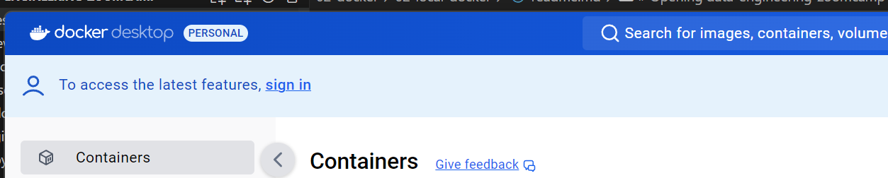

## Opened folder Dev Containers: Open Folder


TOok 1 hr to build. Finnally, the container is build
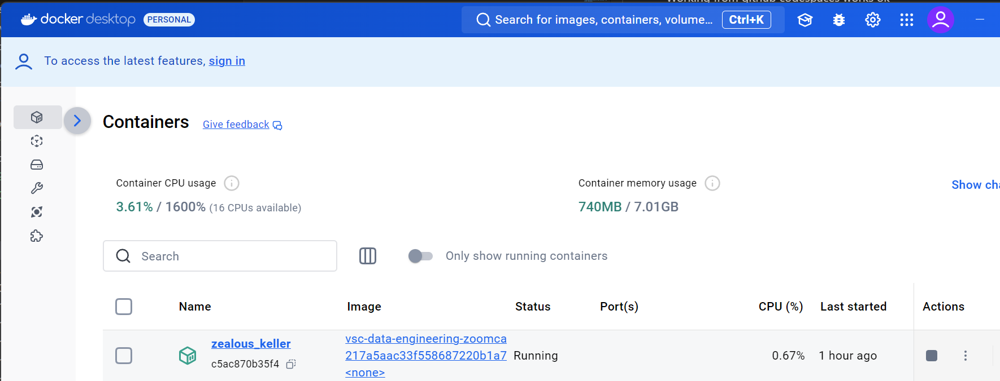

And the folder is opened as Dev Container
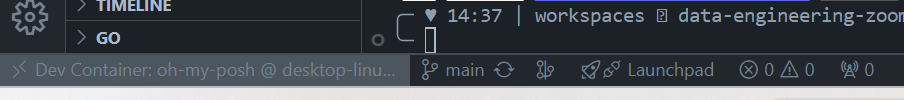

## PROBLEM: Cannot git remote

Troubleshoot:

Based on Article:
https://docs.github.com/en/authentication/connecting-to-github-with-ssh/using-ssh-agent-forwarding 

### Check git config
[`git config -l`](./git-config-l-troubleshoot.sh)

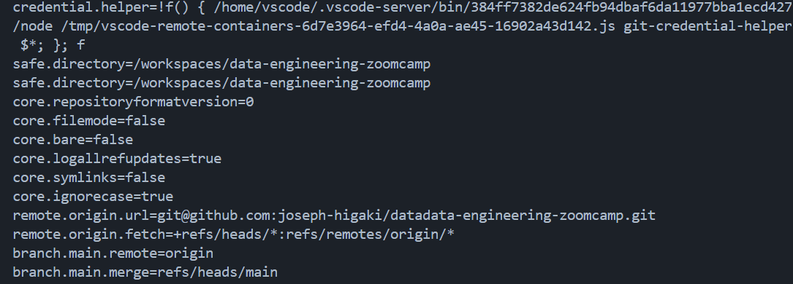

### Check git remote
`git remote show origin` 

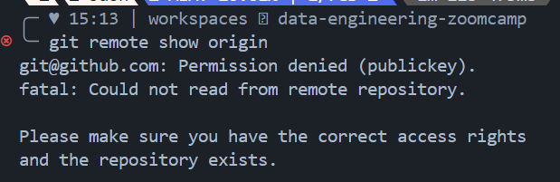

### Check SSH to git 

[`$ssh -v git@github.com`](./ssh-v-github-troubleshoot.sh)
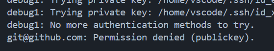

### Check ssh credeintials
ssh-add -l
<table>
<thead>
<tr>
<th>
 Local      
 </th>
<th>
 Codespaces 
 </th>
<th>
 DevContainer   
 </th>
</tr>
<tr>
<td>
run as admin 

```bash
PS C:\Windows\system32> Get-Service -Name ssh-agent | Set-Service -StartupType Manual
PS C:\Windows\system32> Start-Service ssh-agent
```      

```bash
$ ssh-add -l
The agent has no identities
```
</td>
<td>
</td>
<td>
</td>
</tr>
<tr>
<td>
SSH works git pull as well
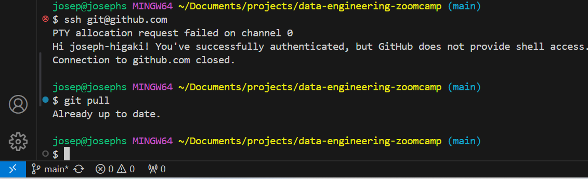
</td>
<td>
SSH doesnt work but git commands do work
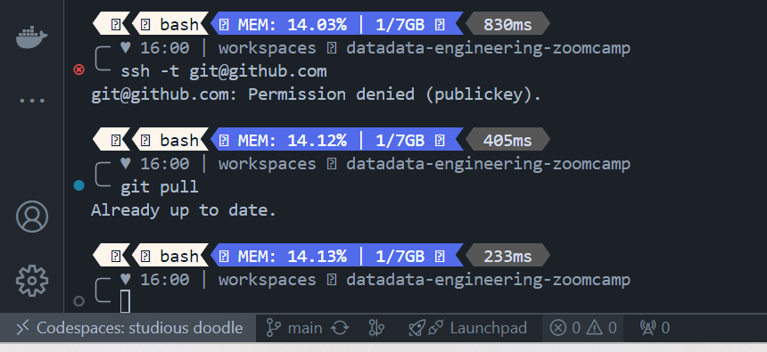

</td>
<td>
SSH doesnt work but git don't work either
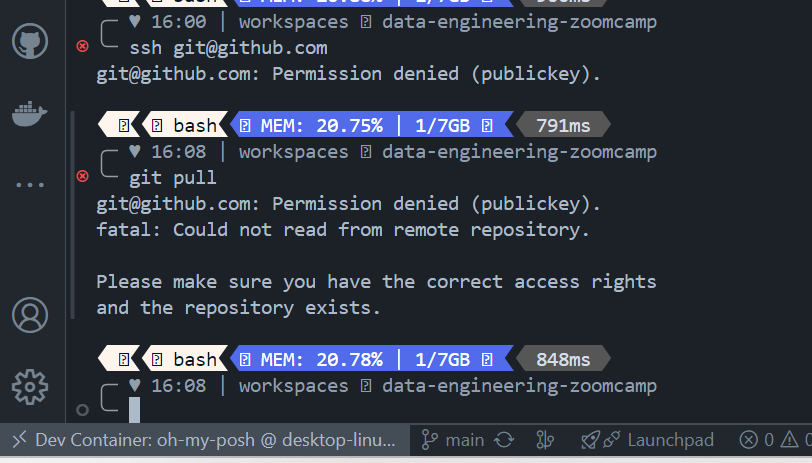
</td>
</tr>
<tr>
<td>
</td>
<td></td>
<td>
I can try do pull from vs.code
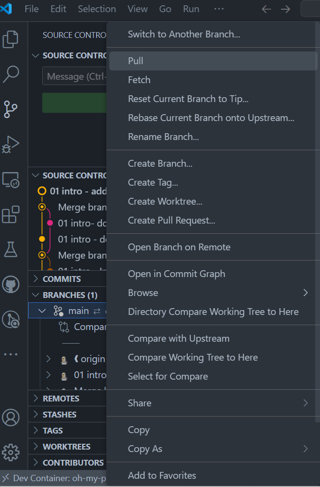

And PULL works
I will try to commit push from dev container

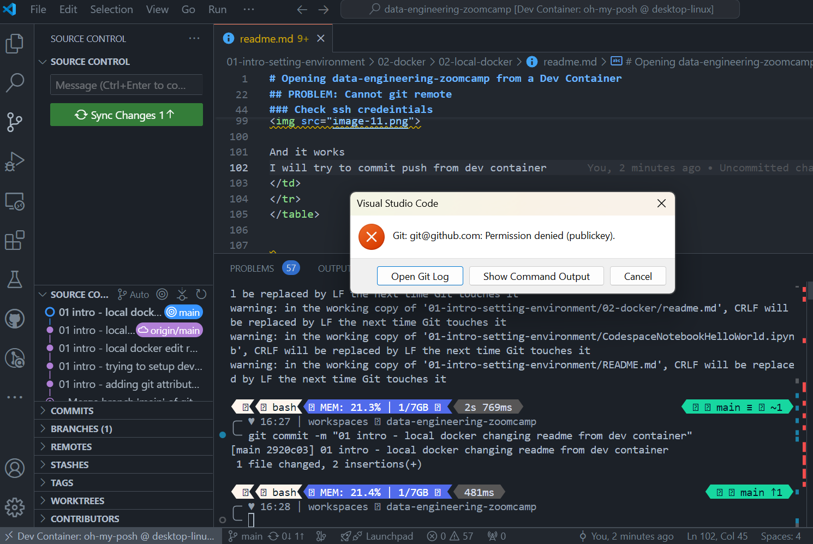
Commit works, push doesn't
</td>
</tr>
</table>

**I'm stuck trying to make dev container work with GITHUB**


Right now I could work by opening the local docker dev container pointing to the same directory from my local system
The only consideration is that I would have to git commands from a local terminal, instead of the vs.code container terminal

One option I may try is the 
https://code.visualstudio.com/remote/advancedcontainers/sharing-git-credentials 

And 
https://docs.github.com/en/get-started/getting-started-with-git/caching-your-github-credentials-in-git 


I'm going to restart my local system:
1. try to connect as is to  ssh git@github.com 
1. try to  connect as is to  ssh git@github.com from dev docker
1. edit .bash_profile REPEAT


For whatever reason this just work. [this is the log](.ssh-v-github-troubleshoot-devContainer-2.sh)

**SOLUTION**
Make sure that Windows local SSH agent is running, BEFORE you start your dev container

```powershell
# Make sure you're running as an Administrator
Set-Service ssh-agent -StartupType Automatic
Start-Service ssh-agent
Get-Service ssh-agent
``` 


https://github.com/ripienaar/free-for-dev/blob/master/README.md