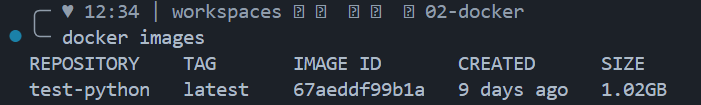
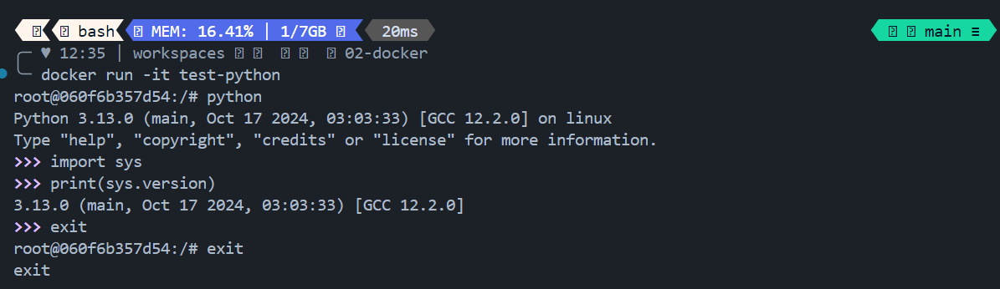
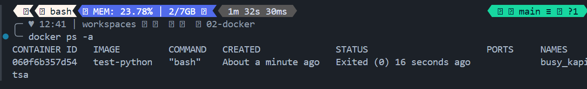
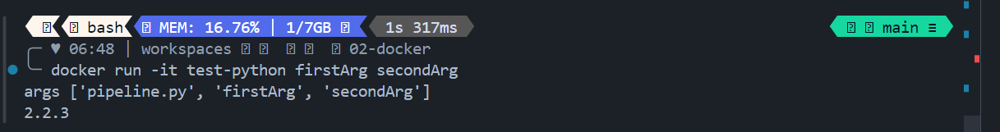

# Docker

## Running Docker

I don't have Docker installed in my Win local laptop
So will try to run docker from the codespace

After I get to setup a postgre docker image, then I can try to run that image in a locally hosted docker

```bash
docker info 
```


1. Build an image

```bash
docker build -f ./PythonDockerfile -t test-python .
```

1. List Docker Images

```bash
docker images
``` 



1. Run newly created Docker Image
   
```bash
docker run -it test-python
```



```bash
docker ps -a
```



1. Have [PythonDockerfile](./PythonDockerfile) start a python simple program 
   
```bash
FROM python:3.10
RUN pip install pandas
WORKDIR /app
COPY pipeline.py pipeline.py
ENTRYPOINT ["python", "pipeline.py"]
```

1. Create a python [pipeline](./pipeline.py)

```python
import sys
import pandas
    
if __name__ == '__main__':
    print(f'args {sys.argv}')
    print(pandas.__version__)
```

1. RE-build docker image 

```bash
docker build -f ./PythonDockerfile -t test-python .
```
1. Execute docker container with args

```bash
docker run -it test-python firstArg secondArg
```



**NEXT DO DOCKER DATA PIPELINE**

**DO WITH LOCAL DOCKER?**