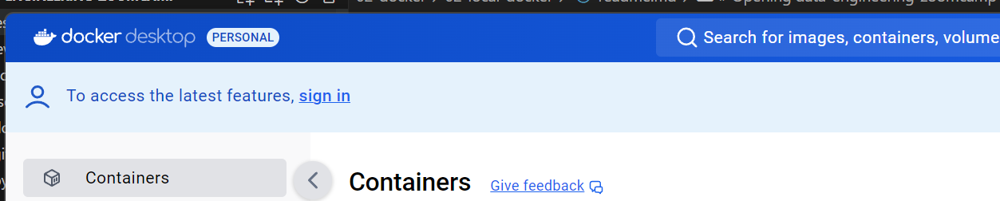
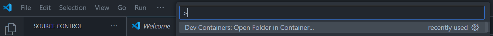
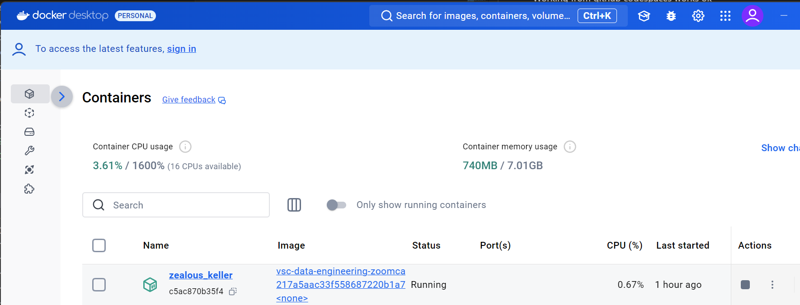
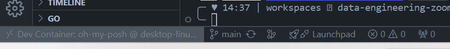
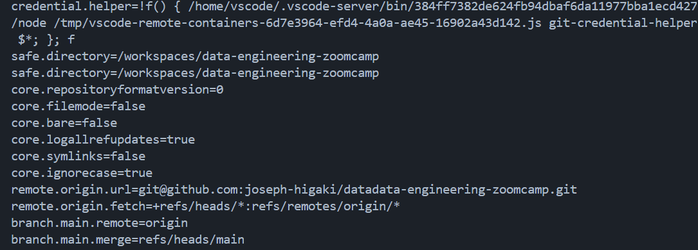
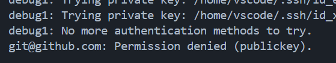

# First let's get GCP setup 
Be careful about billing

Project name: project de-zoomcamp-jhigaki-course
Number: 1066985835377  
ID: de-zoomcamp-jhigaki-course

# Authenticate
From the 3 ways to authenticate
1. Client Libraries
2.  gcloud CLI
3.  REST
4.  Service Account Impersonation


We're going to use [CLient Libraries](https://cloud.google.com/docs/authentication/client-libraries)
using [Application Default Credentials](https://cloud.google.com/docs/authentication/application-default-credentials)

# Setup ADC (Application Default Creds) for a service account

https://cloud.google.com/docs/authentication/provide-credentials-adc

Nice explanation / flowchart about auth to use
https://cloud.google.com/docs/authentication 


## Create Service Account 

Go to IAM & Admin / Service Accounts and create service account:
[see best practices](https://cloud.google.com/iam/docs/best-practices-service-accounts)

1. Since I'm just starting, I'm creating a multi-purpose service account, (THIS IS NOT RECOMMENDED)


1. With a Viewer Role:


1. Not granting any other user access to this service account (optional)

1. Go to service account / manage Keys. create a JSON key


## How to use the service account Key
I have gcloud sdk in my dev countainer



I don't have it in my local win computer


Even though it might be a vulnerability. I will mount a folder containg gcp key, so that i can use it from the dev container

Set environment variable 

```bash
export GOOGLE_APPLICATION_CREDENTIALS="/workspaces/data-engineering-zoomcamp/.gcp.auth/de-zoomcamp-jhigaki-course-XXXXX.json"
```

And then, use them to authenticate
```bash
gcloud auth application-default login
```


But then it asks me to authnticate in the browser with a google account

https://cloud.google.com/docs/authentication/provide-credentials-adc#attached-sa


```bash
gcloud auth login --cred-file=/workspaces/data-engineering-zoomcamp/.gcp.auth/de-zoomcamp-jhigaki-course-XXXXX.json
--cred-file
```
And it works


Continuing with the gcp overview course instructions:
Addded services to the service account


Enable these APIs for `de-zoomcamp-jhigaki-course` :
https://console.cloud.google.com/apis/library/iam.googleapis.com
https://console.cloud.google.com/apis/library/iamcredentials.googleapis.com