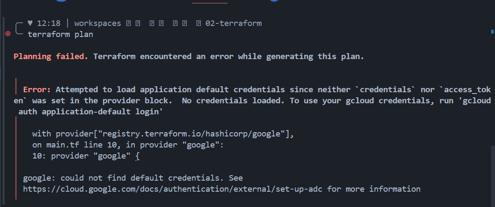
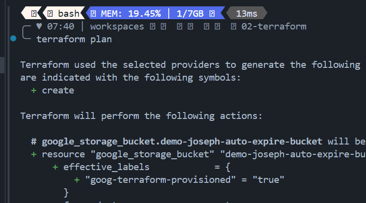
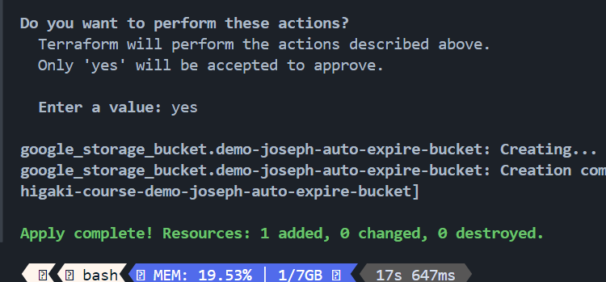
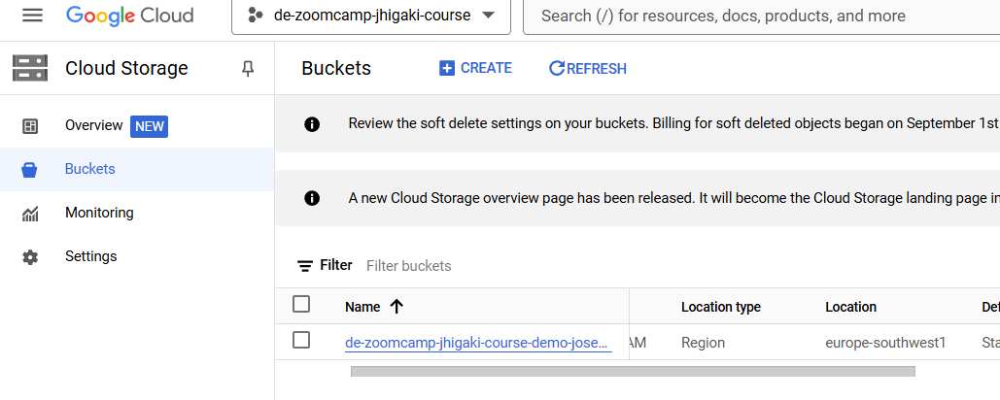

# Terraform 

## Installing Terraform within the container
Terraform was already installed in the provided dev container

## Terraform Authentication
Terraform is asking me to authenticate with Application Default Creds


Which I didn't do in the previous step, as I was trying to avoid authenticating in a browser

Finally I went with the approach of using a credentials file referenced from the terraform `provider.credentials`

```terraform
provider "google" {
  project = "de-zoomcamp-jhigaki-course" 
  region = "europe-southwest1"
  credentials = "/workspaces/data-engineering-zoomcamp/.gcp.auth/de-zoomcamp-jhigaki-course-XXX.json"
}
```

## Terraform Plan
This step verifies there are credentials, but doesn't use them.
When I executed 
`terraform plan` the service account was disables. But the plan was still built


## Terraform Apply
Once service account cred were enabled. Resources were created





I didn't understand if the course instructions were such that application default credentials should only use the service account. 
I took the idea of providing creds as a file referenced from the terraform script from [this video](https://www.youtube.com/watch?v=KilW1B8gxW4&list=PLL220wRvDvTm_MyPtW0W3kc1_Htb3cJev)
I will move forward with the course now, as I make progress, I will figure out a more secure way for authentication.