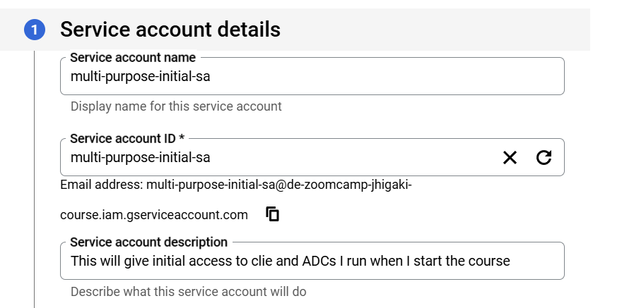
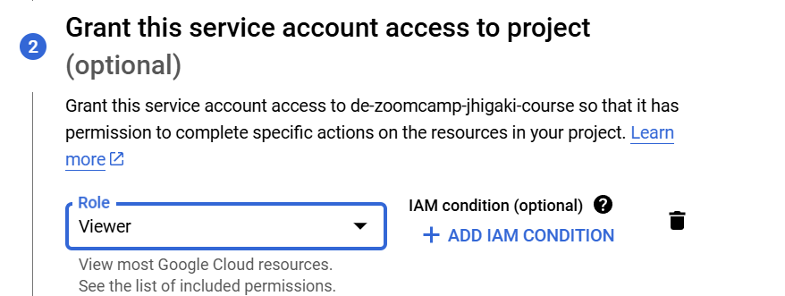
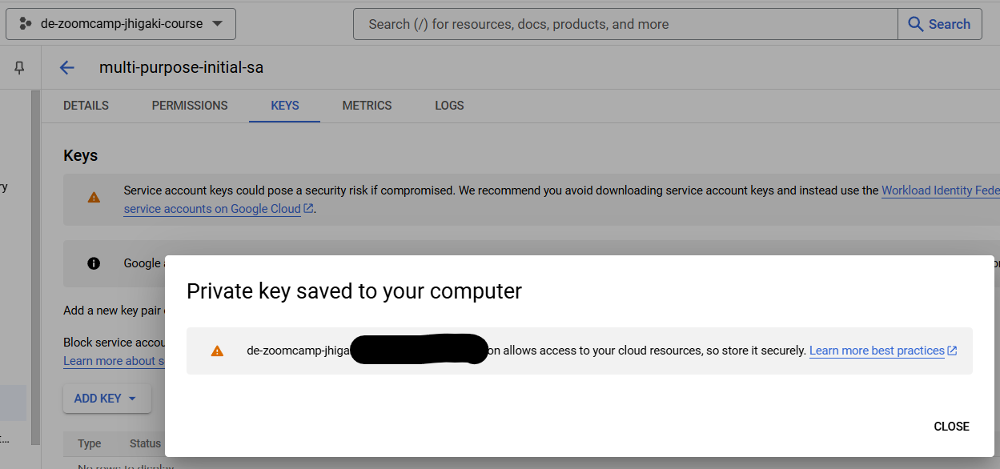
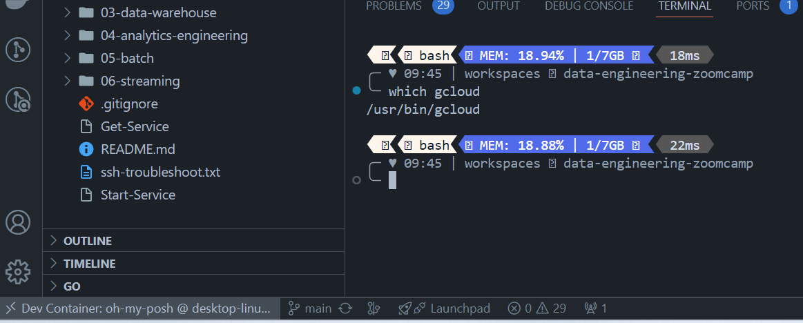
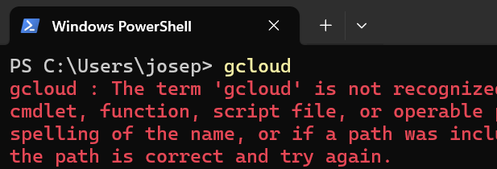

# First let's get GCP setup 
Be careful about billing

Project name: project de-zoomcamp-jhigaki-course
Number: 1066985835377  
ID: de-zoomcamp-jhigaki-course 

# Authenticate
From the 3 ways to authenticate
1. Client Libraries
2.  gcloud CLI
3.  REST
4.  Service Account Impersonation

We're going to use [CLient Libraries](https://cloud.google.com/docs/authentication/client-libraries)
using [Application Default Credentials](https://cloud.google.com/docs/authentication/application-default-credentials)

# Setup ADC (Application Default Creds) for a service account

https://cloud.google.com/docs/authentication/provide-credentials-adc

Nice explanation / flowchart about auth to use
https://cloud.google.com/docs/authentication 

## Create Service Account 

Go to IAM & Admin / Service Accounts and create service account:
[see best practices](https://cloud.google.com/iam/docs/best-practices-service-accounts)

1. Since I'm just starting, I'm creating a multi-purpose service account, (THIS IS NOT RECOMMENDED)

1. With a Viewer Role:

1. Not granting any other user access to this service account (optional)

1. Go to service account / manage Keys. create a JSON key

## How to use the service account Key
I have gcloud sdk in my dev countainer

I don't have it in my local win computer

Even though it might be a vulnerability. I will mount a folder containg gcp key, so that i can use it from the dev container

https://cloud.google.com/docs/authentication/provide-credentials-adc#attached-sa

