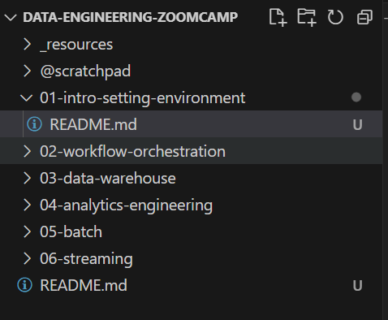

# Setting up 

## Folders and Workspace
I'll be using a single folder for all course artifacts. 
Folder structure


## Init Git 
`git init`


```
git remote add origin git@github.com:joseph-higaki/datadata-engineering-zoomcamp.git
git add.
git commit -m "first commit"
git push -u origin main
```


Failed as I had only setup my newly issued Signing key, added also the Authentication key, and then it worked


Retry `git push`, it worked now


## Attempt 01: Github Codespaces 1
Use a github codespace using [.devcontainer folder](https://github.com/DataTalksClub/data-engineering-zoomcamp/tree/beb77c92b9a0982b718c588bdee207764c319857/.devcontainer) provided at course structure using the [course video](https://www.youtube.com/watch?v=XOSUt8Ih3zA&list=PL3MmuxUbc_hJed7dXYoJw8DoCuVHhGEQb&index=17)

But I just copied the .devcontainer folder to my workspace.
And codespace is created pointing to my workspace.
[Instructions here](../.devcontainer/README.md#option-2-github-codespaces)

1. Create Codespace


1. Opened a new vs code window


1. Asking me to github login


opened a breowser window


1. Asking again to open VS cpde


1. Loading codespace in VS Code (11:47 am)


## Attemp 2: Github Codespaces 2 (if #1 doesn’t work)
Use a github codespace using [.devcontainer folder](https://github.com/DataTalksClub/data-engineering-zoomcamp/tree/beb77c92b9a0982b718c588bdee207764c319857/.devcontainer) provided at course structure using the [course video](https://www.youtube.com/watch?v=XOSUt8Ih3zA&list=PL3MmuxUbc_hJed7dXYoJw8DoCuVHhGEQb&index=17)
codespace is created pointing to the full course cloned repo

### New Codespace


## Attemp 3: GCP Cloud VM 

## Attemp 4: Local Docker and Local Terraform?? video
