# Airflow Setup

Helpful links 

Main Guide from Course: but challenging to follow
https://www.youtube.com/watch?v=lqDMzReAtrw&list=PL3MmuxUbc_hKVX8VnwWCPaWlIHf1qmg8s&index=5

https://datatalks.club/blog/how-to-setup-lightweight-local-version-for-airflow.html

https://github.com/DataTalksClub/data-engineering-zoomcamp/tree/main/cohorts/2022/week_2_data_ingestion/airflow

https://airflow.apache.org/docs/apache-airflow/2.0.2/start/docker.html

https://www.youtube.com/watch?v=N3Tdmt1SRTM
Remember to mount ./airflow so that we don't lose our work????


## Locate gcloud credentials

`/workspaces/data-engineering-zoomcamp/.gcp.auth/de-zoomcamp-jhigaki-course-68ab014c1efe.json`

## Directories Setup

Before running docker airflow commands, create directories before docker-compose  does it with a differnet user

```bash
mkdir 01-airflow-initial
cd 01-airflow-initial
mkdir -p ./dags ./logs ./plugins ./config
```

## Airflow ID
I'm still not sure why I would need to add AIRFLOW_UID as an env variable or into an .env file.
So, for now, not doing it

## Get Apache Docker Compose

```bash 
curl -LfO 'https://airflow.apache.org/docs/apache-airflow/2.10.2/docker-compose.yaml'

curl -O 'https://airflow.apache.org/docs/apache-airflow/stable/docker-compose.yaml'
```

## Edit Downloaded `docker-compose` 

### Image 
I will not customize with a Dockerfile at first
` image: ${AIRFLOW_IMAGE_NAME:-apache/airflow:2.10.2}` 
I see this is done at [Luis instructions](https://github.com/guoliveira/data-engineer-zoomcamp-project/tree/main/Airflow) for the purpose of running GCloud clinent connect and PySpark. This is explained [here](https://datatalks.club/blog/how-to-setup-lightweight-local-version-for-airflow.html)

Remains as is (for now)

`image: ${AIRFLOW_IMAGE_NAME:-apache/airflow:2.10.2}` 

### Make it Lightweight
Removal of redis queue, worker, triggerer, flower, and changing from CeleryExecutor (multi-node) mode to LocalExecutor (single-node) mode

*I found that at airflow-init, there's a folder `./sources` being mounted. I have not created that when created `/dags ./logs ./plugins ./config`*
This is in the full [docker-compse version](https://github.com/DataTalksClub/data-engineering-zoomcamp/blob/main/cohorts/2022/week_2_data_ingestion/airflow/docker-compose.yaml)
```bash
mkdir -p /sources/logs /sources/dags /sources/plugins
chown -R "${AIRFLOW_UID}:0" /sources/{logs,dags,plugins}
```

### Specify Airflow's Postgre Persistance 

`mkdir ./airflow_postgresql_data`

```docker
services:
  postgres:
    ... 
    volumes:
      - ${AIRFLOW_PROJ_DIR:-.}:/airflow_postgresql_data:/var/lib/postgresql/data
```

## Initialize the database

`docker compose up airflow-init`

Result here [1-airflow-initial-docker-compose-up-airflow-init.txt](01-airflow-initial-docker-compose-up-airflow-init.txt)

## Running Airflow
`docker compose up`


Errors

## Setting AIRFLOW_UID

`echo -e "AIRFLOW_UID=$(id -u)" > .env`
My running Id in the container is vscode (1000)

so the `.env` file contains
```
AIRFLOW_UID=1000
```

## Try again

`docker compose up airflow-init | tee docker-compose-up-airflow-init.txt`

`docker compose up | tee docker-compose-up-airflow-init.txt`

Success


## Warning Root User
 get rid of pg warnings rooot? 

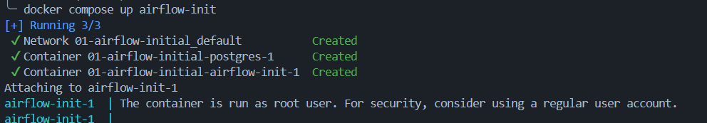
I've set `airflow-init` also to AIRFLOW_UID
Let's see if I have any permission problems down the line

** At this point Airflow is UP **

##  configure GCS cloud 

### Mounted Additional Credentials folder
- ${AIRFLOW_PROJ_DIR:-.}/plugins:/opt/airflow/credentials:ro


### GOOGLE_APPLICATION_CREDENTIALS
POinting to `google_credentials.json` at Creedentials folder

### AIRFLOW_CONN_GOOGLE_CLOUD_DEFAULT
Not sure why?

### GCP Project and Bucket
Set up as variables in `.env` and referrenced at [`docker-compose.airflow-common`](./01-airflow-initial/docker-compose.yaml)
```env
GCP_PROJECT_ID=
GCP_GCS_BUCKET=
```

### Requirements mount
`- ${AIRFLOW_PROJ_DIR:-.}/requirements:/opt/airflow/requirements`

Aiming to do this

```bash
├── dags/
│   └── nyc_taxi_dag.py
├── requirements/
│   ├── base.txt
│   └── task_specific/
│       └── taxi_requirements.txt
├── credentials/
│   └── google_credentials.json
├── plugins/
├── docker-compose.yaml
└── Dockerfile
```

### Creating a Test DAG

I just added apache-airflow to the [requirements file](../../.devcontainer/requirements.txt) of the devContainer

### Debug local (fail)

I couldnt debug it locally, it just served me to hace pyPalance not to complain

### Debug On DOcker Airflow

DAG is reflected there automatically, as DAG folder is mounted

* Go to DAG runs 
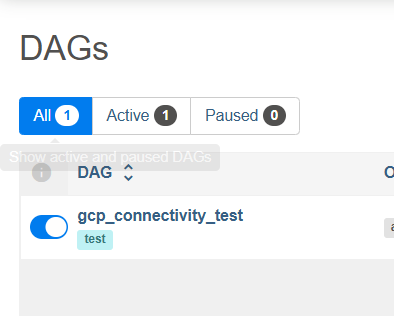

* Select Task for details
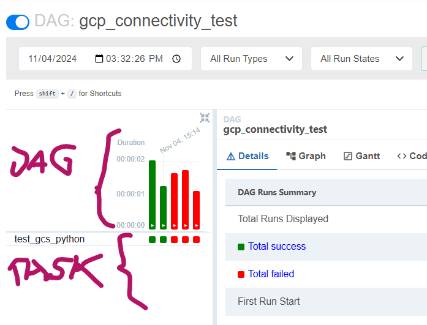

* Select Logs once in the task RUN
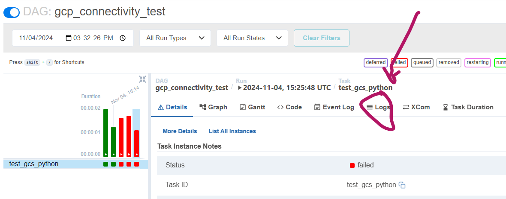

* See log
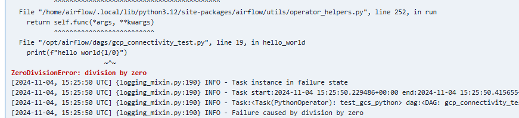

### Test GCS

Error:
```log
  raise exceptions.DefaultCredentialsError(_CLOUD_SDK_MISSING_CREDENTIALS)
google.auth.exceptions.DefaultCredentialsError: Your default credentials were not found. To set up Application Default Credentials, see https://cloud.google.com/docs/authentication/external/set-up-adc for more information.
```

Open bash to the airflow 
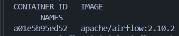

`docker exec -it a01e5b95ed52 /bin/bash`

Changes are not applied 
- Credentials folder not there
- env var GOOGLE_APPLICATION_CREDENTIALS not set

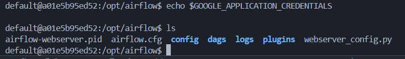

Let's rebuild the airflow instance


***Second Attempt***
```log
 File "/home/airflow/.local/lib/python3.12/site-packages/google/auth/_default.py", line 114, in load_credentials_from_file
    raise exceptions.DefaultCredentialsError(
google.auth.exceptions.DefaultCredentialsError: File /opt/***/credentials/google_credentials.json was not found.
```

Let's check  airflow instance

`docker exec -it 5f61d49cb531 /bin/bash`

`echo $GOOGLE_APPLICATION_CREDENTIALS`

I mounted the wrong credentials folder (plugins into docker.credentials)
FIxed, rebuilt:  **SUCCESS**

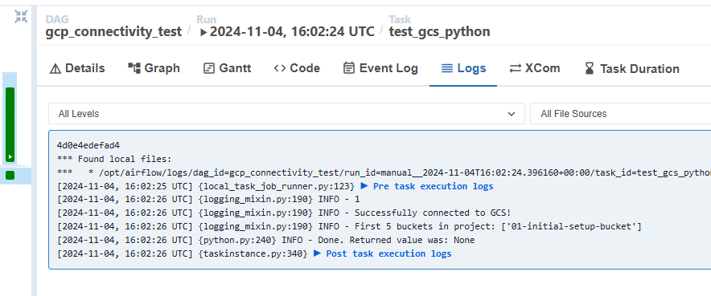


Add to devcontainer.requirements
`apache-airflow-providers-google`

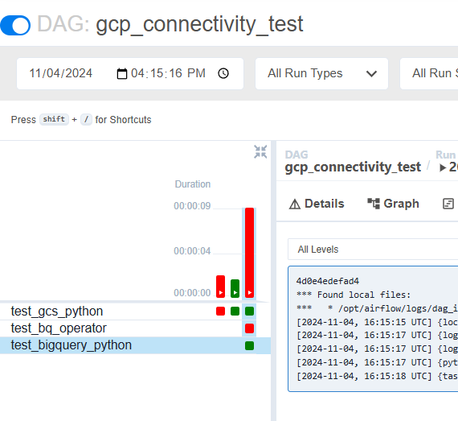

** setup ** 
AIRFLOW_CONN_GOOGLE_CLOUD_DEFAULT: 'google-cloud-platform://?extra__google_cloud_platform__key_path=/opt/airflow/credentials/google_credentials.json'`

And now all three tasks work
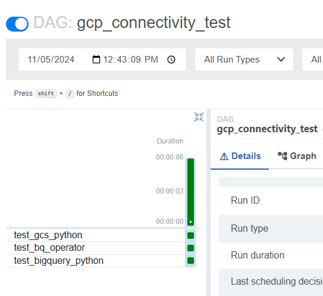

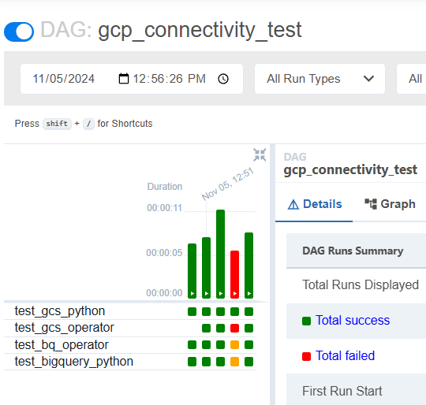

https://airflow.apache.org/docs/apache-airflow/stable/howto/operator/python.html

*
*
*
*
*
*
 create dags
 https://www.youtube.com/watch?v=9ksX9REfL8w&list=PL3MmuxUbc_hKVX8VnwWCPaWlIHf1qmg8s&index=6 

