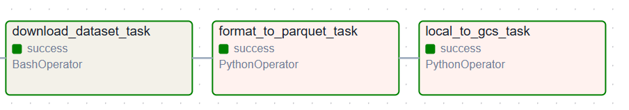
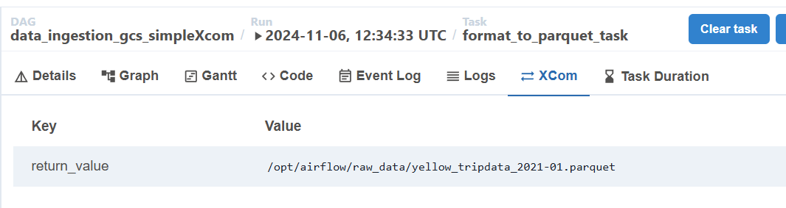

# NYC orchestration

Downloaded the dataset DONE
format it to parquet DONE
pending: upload DONE
pending: upload to GCS -> without parquet disc - PENDING


docker compose -f airflow_nyc_docker-compose.yaml down

## DAG with local storage



* Download Dataset: Downloads file and stores csv at Schedulers: `opt/airflowraw/data` folder 
* Format to Parquet: Uses the same folder `opt/airflowraw/data`, re-formats to parquet and deletes csv
* Local to GCS: Loads from  folder `opt/airflowraw/data` uploads to specified bucket, delets parquet
* Upload to big query

## DAG Task XCOM First simple storage
Exchange file name between tasks

```python
    def format_to_parquet(full_path_src_file):
        ...    
        full_path_output_parquet_file = dataset_parquetfile(full_path_src_file)
        ...
        return full_path_output_parquet_file
```
XCom of task has a `return_value`:



## DAG Task XCOM Blob Backend
exchange fillename, use GCS blob provider


## DAG with no Parameter

`airflow dags trigger data_ingestion_gcs_simpleXcom`

## DAG with Parameter

airflow dags trigger data_ingestion_gcs_simpleXcom --conf '{"source_dataset_url": "https://d37ci6vzurychx.cloudfront.net/trip-data/yellow_tripdata_2021-04.parquet"}'

something wrhon with the pram

check local_togcs_task


[2024-11-06, 15:54:12 UTC] {ingestion_gcs.py:53} INFO - uploaded /opt/***/raw_data/https://d37ci6vzurychx.cloudfront.net/trip-data/yellow_tripdata_2021-04.parquet succesfully to 01-initial-setup-bucket
[2024-11-06, 15:54:12 UTC] {ingestion_gcs.py:55} INFO - removed csv file /opt/***/raw_data/https://d37ci6vzurychx.cloudfront.net/trip-data/yellow_tripdata_2021-04.parquet
[2024-11-06, 15:54:12 UTC] {python.py:240} INFO - Done. Returned value was: gs://01-initial-setup-bucket/yellow_tripdata_2021-04.parquet
[2024-11-06, 15:54:12 UTC] {taskinstance.py:340} ▶ Post task execution logs