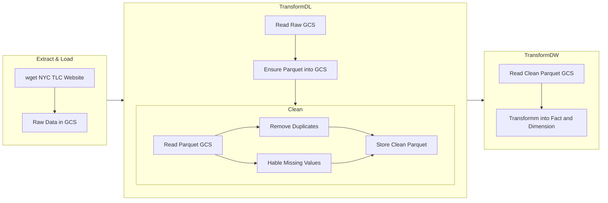

# Orchestration

Orchestration is the process of **dependency management** through **automation**

- Workflow management
- Automation
- Error handling 
- Recovery
- Monitoring, alerting
- Resource optimization
- Observability
- Debugging
- Compliance/Auditing

2024 cohort uses Mage

I want to use Apache Airflow

[Introduction to Workflow Orchestration](https://www.youtube.com/watch?v=0yK7LXwYeD0&list=PL3MmuxUbc_hKVX8VnwWCPaWlIHf1qmg8s&index=4)

## Workflow Description

## Setup Airflow
https://www.youtube.com/watch?v=lqDMzReAtrw&list=PL3MmuxUbc_hKVX8VnwWCPaWlIHf1qmg8s&index=5

Hard video to follow

This video is better to follow 
https://www.youtube.com/watch?v=Sva8rDtlWi4 

https://www.youtube.com/watch?v=N3Tdmt1SRTM
Remember to mount ./airflow so that we don't lose our work

