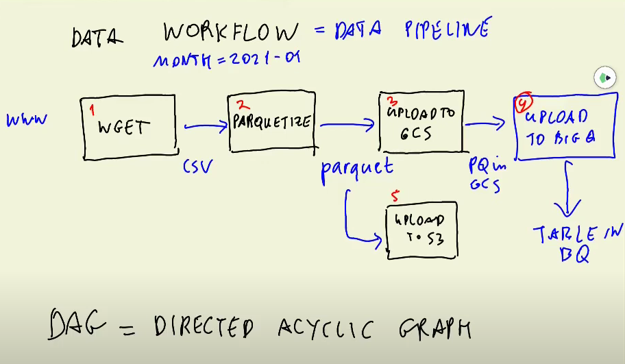

# Orchestration

Orchestration is the process of **dependency management** through **automation**

- Workflow management
- Automation
- Error handling 
- Recovery
- Monitoring, alerting
- Resource optimization
- Observability
- Debugging
- Compliance/Auditing

2024 cohort uses Mage

I want to use Apache Airflow

[Introduction to Workflow Orchestration](https://www.youtube.com/watch?v=0yK7LXwYeD0&list=PL3MmuxUbc_hKVX8VnwWCPaWlIHf1qmg8s&index=4)

## Workflow Description


```mermaid
flowchart TD
    A[Extract] --> B[Transform]
    B --> C[Load]

    subgraph Extract
        A1[Download Data from NYC TLC Website]
        A2[Store Raw Data in GCS]
        A1 --> A2
    end

    subgraph Transform
        B1[Load Raw Data into Staging Area]
        B2[Clean Data (Remove Duplicates, Handle Missing Values)]
        B3[Transform Data (Convert to Parquet if needed)]
        B4[Create Fact and Dimension Tables]
        B1 --> B2
        B2 --> B3
        B3 --> B4
    end

    subgraph Load
        C1[Load Data into BigQuery]
        C2[Create Fact Table in BigQuery]
        C3[Create Dimension Tables in BigQuery]
        C4[Load Transformed Data into Fact and Dimension Tables]
        C1 --> C2
        C1 --> C3
        C2 --> C4
        C3 --> C4
    end

```


## Setup Airflow
https://www.youtube.com/watch?v=lqDMzReAtrw&list=PL3MmuxUbc_hKVX8VnwWCPaWlIHf1qmg8s&index=5

Hard video to follow

This video is better to follow 
https://www.youtube.com/watch?v=Sva8rDtlWi4 

https://www.youtube.com/watch?v=N3Tdmt1SRTM
Remember to mount ./airflow so that we don't lose our work

