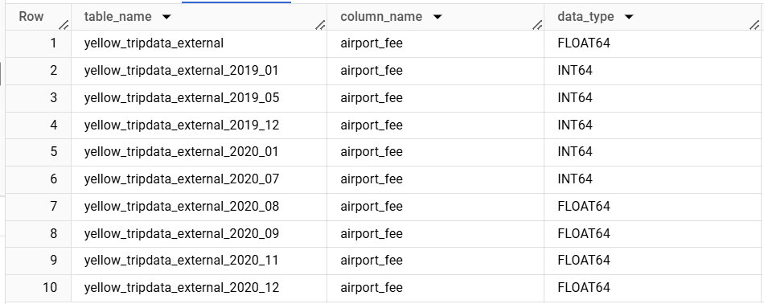

# Isssues 

## Recreate table as _external
```sql 
ALTER TABLE nyc_taxi.yellow_tripdata  RENAME TO nyc_taxi.yellow_tripdata_external

Cannot rename de-zoomcamp-jhigaki-course:nyc_taxi.yellow_tripdata which has type EXTERNAL TABLE. Allowed types: [TABLE, SNAPSHOT]

so we just recreate it:

CREATE OR REPLACE EXTERNAL TABLE nyc_taxi.yellow_tripdata_external
OPTIONS(
  format = 'parquet',
  uris = [
    'gs://01-initial-setup-bucket/yellow_tripdata_2019*.parquet',
    'gs://01-initial-setup-bucket/yellow_tripdata_2020*.parquet'
  ]
);
```

### Data Types mismatches

When trying to query airport_fee or the full table 
```sql
CREATE OR REPLACE TABLE de-zoomcamp-jhigaki-course.nyc_taxi.yellow_tripdata_non_partitioned AS
SELECT * FROM de-zoomcamp-jhigaki-course.nyc_taxi.yellow_tripdata_external;

Parquet column 'airport_fee' has type INT32 which does not match the target cpp_type DOUBLE.
```

So, created some external tables with single parquet file source `yellow_tripdata_external_2019_XX` and `yellow_tripdata_external_2019_XX`
```sql
SELECT table_name, column_name, data_type 
  FROM  nyc_taxi.INFORMATION_SCHEMA.COLUMNS
  WHERE    column_name = 'airport_fee'
  order by table_name
```



It looks like I have to either:
1. [enforce the data types](https://github.com/ziritrion/dataeng-zoomcamp/blob/main/notes/extra1_preparing_data.md) from columns when uploading it to GCS 
2. Exclude airport fee

**For the sake of progress, now I'm going to exclude airport_fee**
