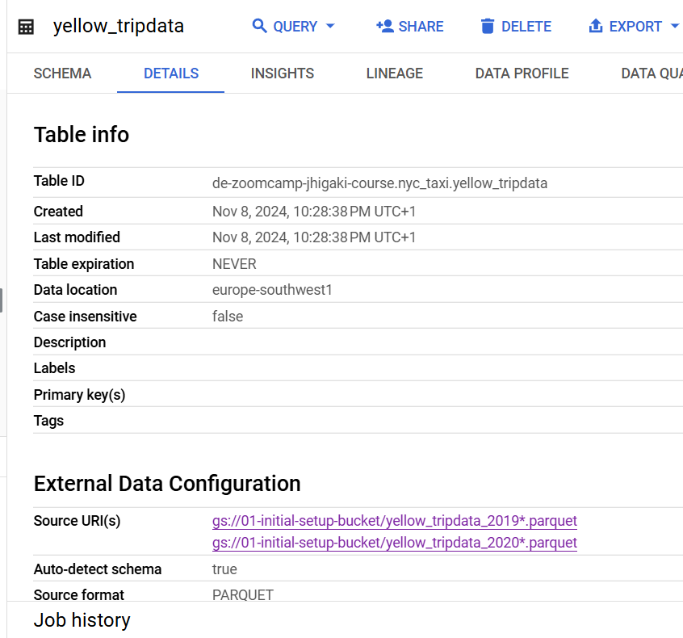
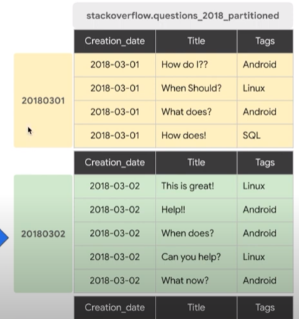
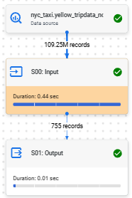
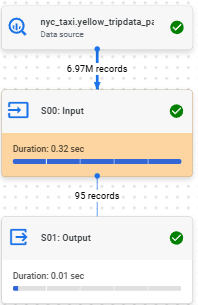

# Data Warehouse
https://github.com/DataTalksClub/data-engineering-zoomcamp/tree/main/03-data-warehouse

## Relational Database Management System Categories

OLTP vs OLAP

|   | OLTP | OLAP |
|---|---|---|
|Focus|Transaction Processing|Analysis of Data|
|Operations|Optimized for multiple (even concurring) small writing operations|Optimized for large chunks of data reading and summarization|
|Modeling|Normalized to prioritize write efficiency|De-Normalize to prioritize read efficiency|
|Data Granularity|Very detailed, up to the transaction record|Can be summarized as multiple tables can contain the the same information at a different summarization level. Eg: single record of sales by month, or sales by product category.|
|Use cases| ERPs, eCommerce, HR clocking system | Sales Data Warehouse, HR Attendance Dashboard and trends |

## Google's  Big Query
 Datawarehouse by GCP
* Serverless. PaaS 
* Scalable, high availability 
* Built in features

[Pricing](https://cloud.google.com/bigquery/pricing)


### External Table

The schema was inferred from the source

```sql
CREATE OR REPLACE EXTERNAL TABLE nyc_taxi.yellow_tripdata
OPTIONS(
  format = 'parquet',
  uris = [
    'gs://01-initial-setup-bucket/yellow_tripdata_2019*.parquet',
    'gs://01-initial-setup-bucket/yellow_tripdata_2020*.parquet'
  ]
);
```

The data is not in Big Query, in this case, it is in GCS




### Partitioned Tables
Table divided into segments, called partitions


Data is stored in physical blocks, each of which holds one partition of data.
Each partition has metadata which allows BigQUery to **estimate query cost before query run**

COnsider partition [limits](https://cloud.google.com/bigquery/quotas#partitioned_tables)
per table: 10 000 (if exceed consider clustering in addition)
modified by single job: 4 000

#### create a NON-partitioned and partitioned tables

Run into some issues, see [Recreate table as _external](issues.md#recreate-table-as-_external) and [Data Types mismatches](issues.md#data-types-mismatches)

```SQL

CREATE OR REPLACE TABLE de-zoomcamp-jhigaki-course.nyc_taxi.yellow_tripdata_non_partitioned AS
SELECT *  except(airport_fee) FROM de-zoomcamp-jhigaki-course.nyc_taxi.yellow_tripdata_external;

CREATE OR REPLACE TABLE de-zoomcamp-jhigaki-course.nyc_taxi.yellow_tripdata_partitioned 
PARTITION BY 
  DATE(tpep_pickup_datetime) AS
SELECT *  except(airport_fee) FROM de-zoomcamp-jhigaki-course.nyc_taxi.yellow_tripdata_external;
```

### Clustering
Tables have a user-defined column(s) sort order

Improves:
* Filter
* Aggregates

Tables should be > 1GB to be worth of partitioning and clustering (because of the added metadata)


```sql
CREATE OR REPLACE TABLE de-zoomcamp-jhigaki-course.nyc_taxi.yellow_tripdata_partitioned_clustered
PARTITION BY DATE(tpep_pickup_datetime) 
CLUSTER BY VendorID AS
SELECT *  except(airport_fee) FROM de-zoomcamp-jhigaki-course.nyc_taxi.yellow_tripdata_external;
```

### Partitioning vs CLustering
|   | partitioned | clustered |
| --- | --- | --- |
| Cost  | Known upfront | knwon after execution  |
| Cardinalty | Low (Few Unique valies) | High (Many Unique Values) |
| Technique | Different child/partition physical tables | Columns sort |
| Column | single column  | up to 4 columns |


### Prefer Clustering over Partition
* Mutations affect most of your partitions
* Partition column has high cardinality

### Best PRactices
- PRice QUeries before (right upper corner )
- order last
- 

### Internal Big QUeyry 
- Colossus as storage (cheap)
- Column Oriented
- QUery divided in chunks and workers


### Executing and Comparing Queries

executing queries
```sql
SELECT vendorID, count(1)
FROM nyc_taxi.yellow_tripdata_non_partitioned -- partitioned
where '2019-06-01' <= DATE(tpep_pickup_datetime)
and  DATE(tpep_pickup_datetime) <= '2019-06-30'
group by vendorID

SELECT vendorID, count(1)
FROM nyc_taxi.yellow_tripdata_partitioned
where '2019-06-01' <= DATE(tpep_pickup_datetime)
and  DATE(tpep_pickup_datetime) <= '2019-06-30'
group by vendorID

```

based on `yellow_tripdata_external`
|   | non-partition | partitioned | p &clustered |
|---|---|---| --- |
|Row count|109,247,536|109,247,536| 109,247,536|
|Total Logical Bytes|14.07 GB|14.07 GB| 14.07 GB|
|Active Logical Bytes|14.07 GB|14.07 GB| 14.07 GB|
|Query Processing||| |
|Bytes Processed|1.63 GB|106.37 MB|106.37 MB |
|Bytes billed|1.63 GB|107 MB| 107 MB|
|Elapsed Time|595 ms|294 ms| 533ms |
|Slot COnsumed|1min 4 sec|10 sec| 4 sec|
|First stage records read|109247536|6971335| 6971335|
|Exec Graph||| |
