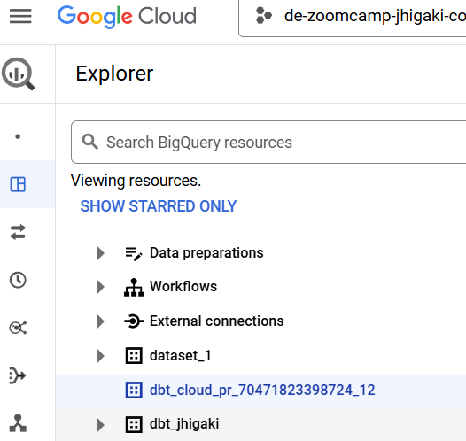

# NYC Taxi 

## Data in buckets
Yellow taxi data - Years 2019 and 2020 (yes)
Green taxi data - Years 2019 and 2020 (yes)
fhv data - Year 2019 (yes)

## Raw

1. Upload each parquet to GCS (airflow) as is
1. Create one external table per month at GBQ (dbt)

###  The problem, too many models (36)
The problem of this is, that I need to create one table per month, so I generated a [script with 36 create tables](../init_external_tables.sql)

And then, I need to generate 36 staging models for the `raw` layer

###  The problem querying external tables from dbt

```bash
Runtime Error Database Error in model raw_yellow_tripdata_2019_01 (models/raw/raw_yellow_tripdata_2019_01.sql) Access Denied: BigQuery BigQuery: Permission denied while globbing file pattern. dbt-service-account-2@de-zoomcamp-jhigaki-course.iam.gserviceaccount.com does not have storage.objects.list access to the Google Cloud Storage bucket. Permission 'storage.objects.list' denied on resource (or it may not exist). 

Please make sure gs://01-initial-setup-bucket/green_tripdata_2019*.parquet is accessible via appropriate IAM roles, e.g. Storage Object Viewer or Storage Object Creator.

Please make sure gs://01-initial-setup-bucket/green_tripdata_2019*.parquet is accessible via appropriate IAM roles, e.g. Storage Object Viewer or Storage Object Creator.
```
Go to GCP IAM / ON the principal edit rolesA


Add Storage OBject Viewer


1. standardize data types
Using the approach of union all accross months with set formulas and casts for all months

I will first list all columns
```sql
with 
source as (    
    
        
        select 
            {{ dbt_utils.star(from=source('raw', table_name), quote_identifiers=False) }}          
        from {{ source('raw', table_name) }}
        
            union all              
                
    
)
```

used the regex 
```bash
^(.*),$
{{ dbt.cast("$1", api.Column.translate_type("some_type")) }} as $1
```
to come up with yellow columns

```sql
{{ dbt.cast("VendorID", api.Column.translate_type("int")) }} as VendorID,
{{ dbt.cast("tpep_pickup_datetime", api.Column.translate_type("timestamp")) }} as tpep_pickup_datetime,
...
```
See macro with [yellow columns here](./macros/get_raw_yellow_tripdata_columns.sql)

I will build the raw_yellow_tripdata_all as a materialized table 

## Staging


### Data Cleaning: 
### Deduplication of records, find a key    
Key: **the whole row**

[Analysis here](./finding_yellowtripdata_key.md)

### Standardize column names
    1. VendorID -> vendor_id
    1. PULocationID -> pickup_location_id
    1. DOLocationID -> dropoff_location_id
    1. tpep_pickup_datetime -> pickup_datetime
    1. lpep_pickup_datetime -> pickup_datetime
    1. Pickup_datetime -> pickup_datetime
    1. lpep_dropoff_datetime -> dropoff_datetime    

### Standardize between yellow and green columns

|yellow               |green                      |
|---------------------|---------------------------|
|DOLocationID         |DOLocationID               |
|PULocationID         |PULocationID               |
|RatecodeID           |RatecodeID                 |
|VendorID             |VendorID                   |
|airport_fee          |                           |
|congestion_surcharge |congestion_surcharge       |
|                     |ehail_fee                  |
|extra                |extra                      |
|fare_amount          |fare_amount                |
|improvement_surcharge|improvement_surcharge      |
|mta_tax              |mta_tax                    |
|passenger_count      |passenger_count            |
|payment_type         |payment_type               |
|tpep_dropoff_datetime|lpep_dropoff_datetime      |
|tpep_pickup_datetime |lpep_pickup_datetime       |
|store_and_fwd_flag   |store_and_fwd_flag         |
|tip_amount           |tip_amount                 |
|tolls_amount         |tolls_amount               |
|total_amount         |total_amount               |
|trip_distance        |trip_distance              |
|                     |trip_type                  |


When implementing TESTS
1. Valid lookup values

## Core
1. Fact trip
    DONE

1. Dim Taxi Zones
1. Dim Payment Types?
1. 

next steps

test
4.3.2
https://www.youtube.com/watch?v=2dNJXHFCHaY&list=PLaNLNpjZpzwgneiI-Gl8df8GCsPYp_6Bs&index=3
HOW TO DEPLOY AND DO INCREMENTAL! 
 4.4.1 - 
 https://www.youtube.com/watch?v=V2m5C0n8Gro&list=PLaNLNpjZpzwgneiI-Gl8df8GCsPYp_6Bs&index=6


## Generate Model Yaml
https://hub.getdbt.com/dbt-labs/codegen/latest/

install by CLI: 
`dbt deps`

then to generate Model schema do, in the `raw` directory for example
```sql

{{ codegen.generate_model_yaml(
    model_names = models_to_generate
) }}
```

And it will generate the yaml file that goes in the [`schema.yml`](./models/raw/schema.yml), beneath sources


## Existential Concern 
* Where to put generic or singular tests at which stage? 
https://docs.getdbt.com/faqs/Tests/when-to-test 

[What tests should I add to my project?](https://docs.getdbt.com/faqs/Tests/recommended-tests )
* [every model on pk: unique / not null ](https://docs.getdbt.com/best-practices/best-practice-workflows#add-tests-to-your-models)
* *In advanced dbt projects, we recommend using sources and running these source data-integrity tests against the sources rather than models.*  

## Data Tests
    * [GEneric](https://docs.getdbt.com/docs/build/data-tests#generic-data-tests): can be 
        * DEfined in a `` block receiving model, column
        * out of the box: unique, not null, accepted values, or relationships
        * community based:  dbt-utils and dbt-expectations 
            * https://hub.getdbt.com/calogica/dbt_expectations/latest/
            * https://hub.getdbt.com/dbt-labs/dbt_utils/latest/ 
    * [Singular](https://docs.getdbt.com/docs/build/data-tests#singular-data-tests): can be speciffic queries in the /tests folder raising records for custom logic. ADd each test in the tests/schema.yml

[Unit Tests](https://docs.getdbt.com/docs/build/unit-tests)

`dbt test -m core `

## Documentation

`dbt docs generate `

I wasn't able to see generated docs, because apparently I didn't have PROD or STA environments


## Deployment
4.4.1
https://www.youtube.com/watch?v=V2m5C0n8Gro&list=PLaNLNpjZpzwgneiI-Gl8df8GCsPYp_6Bs&index=6

dbt operates on the datawarehouse (database)


## Environments
 * dbt Cloud environment = dbt Core Profiles.yml entries

* Developoer credentials for data source (Big QUery) are used for DEvelopment environment. These were set at dbt Cloud profile setting [see](../dbt_setup.md#create-specific-gcp-service-account)

# Best practices

## Structure
I did a 
├── models
│   ├── raw
│   ├── staging
│   ├── core

structure recommended
├── models
│   ├── staging
│   ├── intermediate
│   ├── marts

## Style
https://docs.getdbt.com/best-practices/how-we-structure/1-guide-overview

## Run / Build
* RUn: executes comiled SQL according to materialization strategy
* Build: run + tests 
https://www.castordoc.com/blog/dbt-build-vs-dbt-run 

BUild is preferred (speciallyin PROD) so it executes tests first
https://hevodata.com/learn/dbt-build-vs-dbt-run/


## Use run or build 
Examples on how you can run by modified state or previous run results
 https://docs.getdbt.com/best-practices/best-practice-workflows#run-only-modified-models-to-test-changes-slim-ci
It looks like it can save **LIMITED BUILD EVENTS**


## Materialization changes
I changed staging to be materialized as view
Got the error because couldn't create views as a table already existed
Had to use full refresh
`dbt build --vars '{'is_test_run': 'false'}' --full-refresh`
 

 ## CI Jobs

 It create s a prefixed dataset
 
 
 During the job execution, 
 

After it completes:
 

 I still don't understand how the dbt CI test is launched upon PR

 
 # INcremental changes