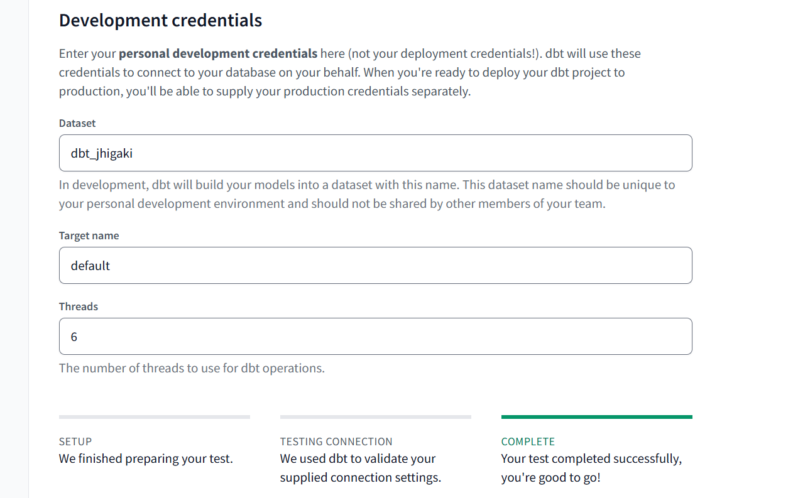
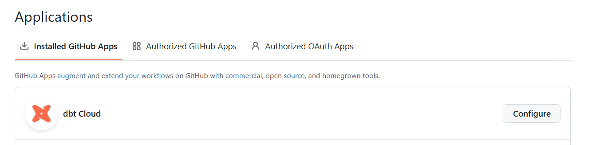
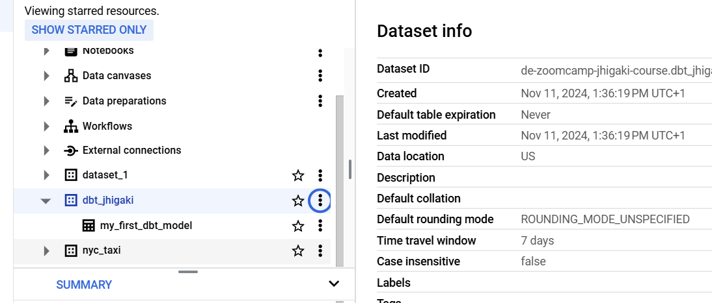
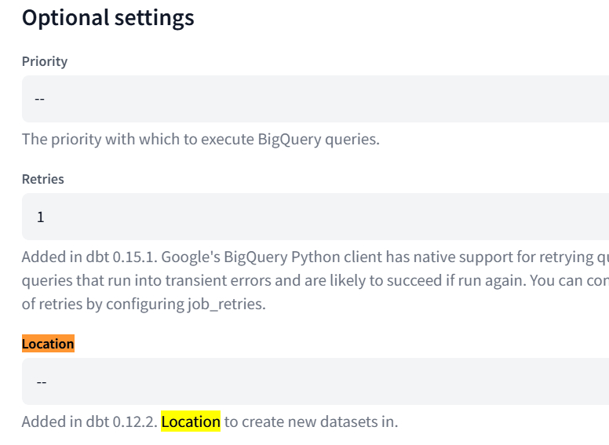
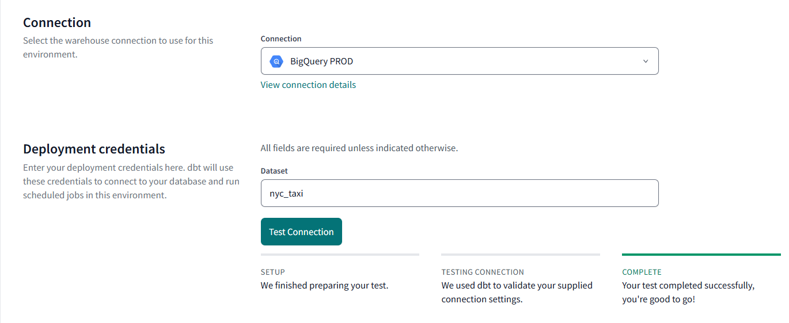
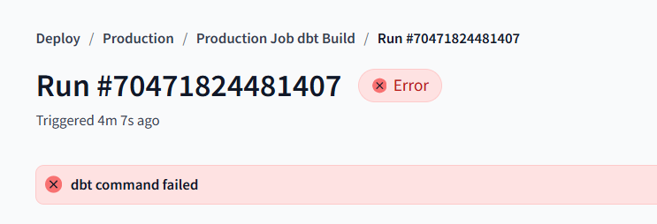
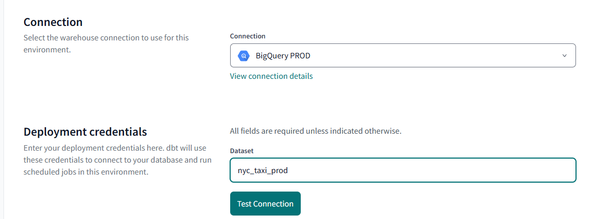

# dbt Setup

https://github.com/DataTalksClub/data-engineering-zoomcamp/tree/main/04-analytics-engineering

https://github.com/DataTalksClub/data-engineering-zoomcamp/blob/main/04-analytics-engineering/dbt_cloud_setup.md 

https://www.youtube.com/watch?v=J0XCDyKiU64&list=PL3MmuxUbc_hJed7dXYoJw8DoCuVHhGEQb&index=42

## Create specific GCP service Account
- BigQuery Data Editor
- BigQuery Job User
- BigQuery User


dbt Cloud 
Submit credentials.json to dbt cloud:
*dbt Cloud will always access your connection from 52.3.77.232, 3.214.191.130, or 34.233.79.135.*

Test


Not sure what it did, as there isn't a dbt_jhigaki dataset in my BigQuery project

I granted access to githubrepo through the dialogs:


- [ ] I wasn't requred to create another SSH key. **SHould I?**


## Issues

### development Dataset default location

Models created in dbt run in `dbt_jhigaki` dataset
WHen tried to run the whole project
the example model created 
`dbt_jhigaki` dataset
But it created it the US



WHen I build my staging model it says

```bash
13:26:26 Database Error in model stg_green_tripdata (models/staging/stg_green_tripdata.sql)
  Not found: Dataset de-zoomcamp-jhigaki-course:dbt_jhigaki was not found in location europe-southwest1
  compiled code at target/run/nyc_taxi/models/staging/stg_green_tripdata.sql
13:26:26 2 of 7 ERROR creating sql view model dbt_jhigaki.stg_green_tripdata ............ [ERROR in 0.38s]
13:26:26 Finished running node model.nyc_taxi.stg_green_tripdata
13:26:31   Database Error in model stg_green_tripdata (models/staging/stg_green_tripdata.sql)
  Not found: Dataset de-zoomcamp-jhigaki-course:dbt_jhigaki was not found in location europe-southwest1
  compiled code at target/run/nyc_taxi/models/staging/stg_green_tripdata.sql
```

I'm not sure where did I tell dbt to look for `europe-southwest1`

But I did find an optional setting in dbt / connections / BigQuery
where to set the dataset connection



Changed it to `europe-southwest1`

Now it works 

### green taxi column data types (again, last time was ith yellow)

`Error while reading table: de-zoomcamp-jhigaki-course.nyc_taxi.green_tripdata, error message: Parquet column 'ehail_fee' has type DOUBLE which does not match the target cpp_type INT64. File: gs://01-initial-setup-bucket/green_tripdata_2019-03.parquet`

so, to work around it, instead of having my dbt model query from an `external` table like this:
```sql
 external table nyc_taxi.green_tripdata
Source URI(s)
gs://01-initial-setup-bucket/green_tripdata_2019*.parquet
gs://01-initial-setup-bucket/green_tripdata_2020*.parquet
```
I will use a materialized table:

```sql
CREATE OR REPLACE TABLE nyc_taxi.green_tripdata
as 
  select * except(ehail_fee) from nyc_taxi.green_tripdata_external
```

*** UPDATE on workaround *** 
I used a one external table per parquet and later forced column casting for each `union all` table per month 

## Environments
I created only development environment

[Why and how staging environment](https://docs.getdbt.com/docs/deploy/deploy-environments#staging-environment)


##  Setting up a Big QUery sepearate project

Project: nyc-taxi-prod
dataset: nyc_taxi

service account: dbt-nyc-taxi@nyc-taxi-prod.iam.gserviceaccount.com

https://docs.getdbt.com/guides/bigquery?step=4
1. Setting up Roles to  BigQuery Job User and BigQuery Data Editor
1. Created a service account key

### DBT PROD connection
 created a new Connection `BigQuery PROD` with the service account key
 (didn't specified GC madrid location, may need to)




### Created a job and run it
Failed because my source is at a different GCP project than the PROD  credentials

```bash
Reason: Database Error in model raw_green_tripdata_all (models/raw/raw_green_tripdata_all.sql)
  Access Denied: Table de-zoomcamp-jhigaki-course:nyc_taxi_raw.green_tripdata_2019_01_external: User does not have permission to query table de-zoomcamp-jhigaki-course:nyc_taxi_raw.green_tripdata_2019_01_external, or perhaps it does not exist.
  ```

## Issues having different GCP Projects

1. dbt seems to be using a single user so;
  1. Your raw data should be EXTRACTED and LOADED into your PROD GCP project
  1. Depending on the environment dbt runs, sources should be different
  1. Depending on the environment dbt runs, sources need to change accordingly. Didn't find (or searched, how to do this). I think you can use environment variables win the source file
  1. Depending on the  environment dbt runs, credentials need to be provided:  https://xebia.com/blog/managing-multiple-bigquery-projects-with-one-dbt-cloud-project/
  
  1. for now, to close the circle, and until i can put the EL data in the PROD database, I will use the same project



THe question remains:
* It is not recommended having a GCP service key that has access to multiple projects
* dbt uses a single connection for the run, that includes:
  * Reading sources
  * Writing into materialized tables
* Why in source.yml we need to specify `database`. On which scenario in GCP Big Query, the source database would be a different project than the connection it grants accessto 


##  Succesfully run DBT job in production

## What about CI jobs