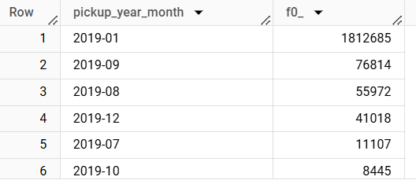

##  FHV Data Issues

```sql
with fhv as (
    select 
        cast(pickup_datetime as STRING FORMAT 'YYYY-MM') pickup_year_month, 
        *
    from nyc_taxi_prod.fact_fhv_tripdata
)
select    
    pickup_year_month,
    count(1)
from fhv
where 1=1
and pickup_location_id is null
group by 
pickup_year_month
order by 2 desc
```


January has a lot of pickup location nulls

