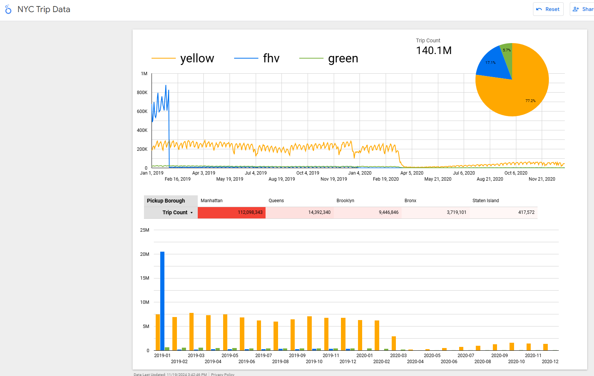

# Looker Studio Dashboard
After setting up 
`dim_zone`
`fact_taxi_tripdata`
`fact_fhv_tripdata`

Went to setup a dashboard in Looker Studio

## New Data Source

Created a fact that unions fhv, yellow and green to be able to count trips overall

## [NYC Trip Count Report](https://lookerstudio.google.com/s/ti0IJYpRBfs)

