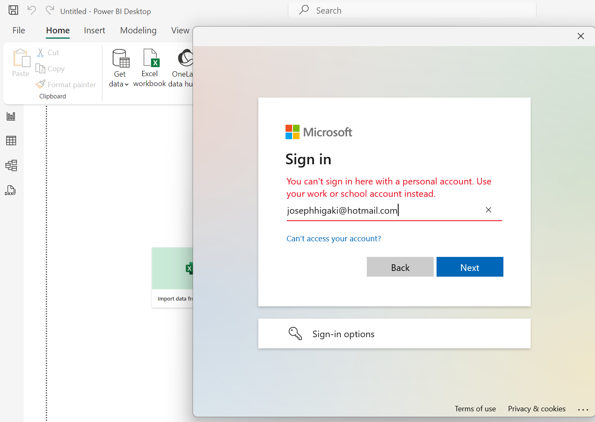
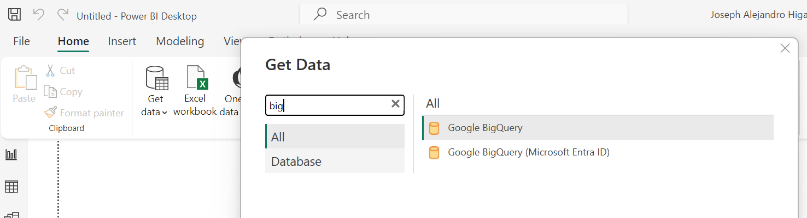
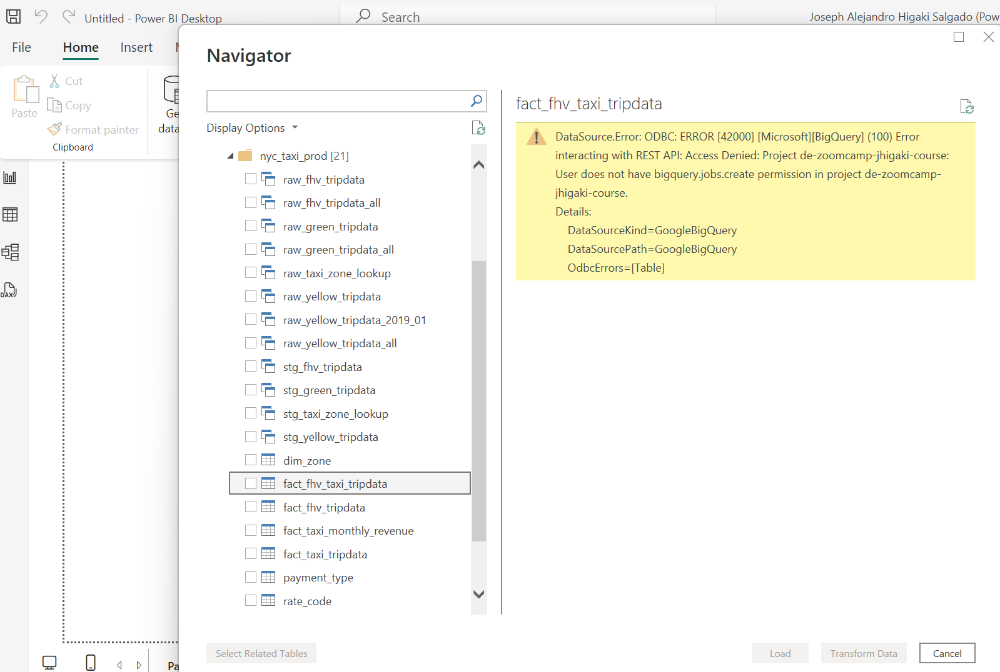
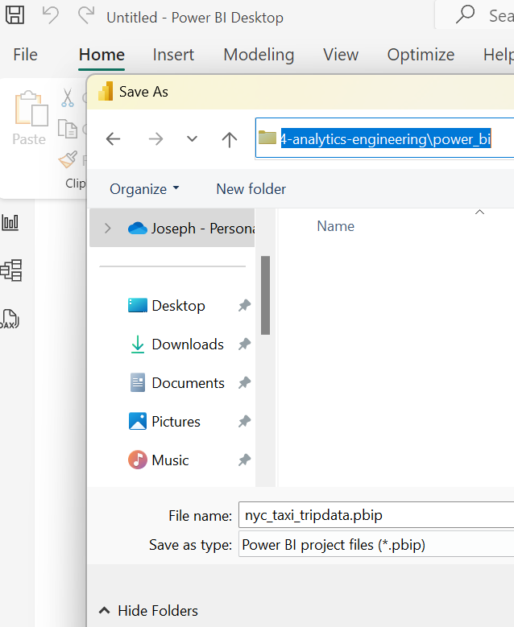
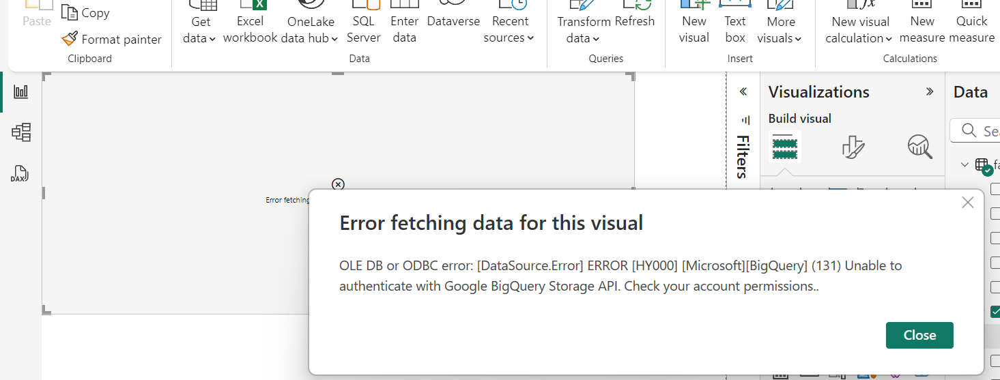
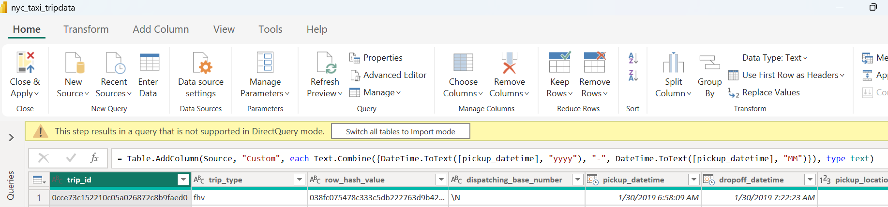
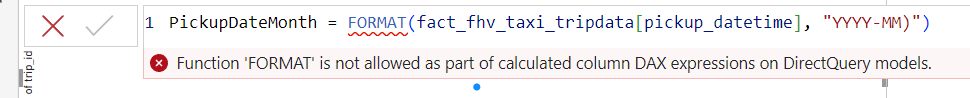

# Power BI

Says its got version controLl!!!!!!!

First issue haha

Created a service account with Permissions

It looks not enough

Added  `BigQuery Job User`

Set it up as `Direct Connection`

Save as pbip (Power Bi Project)

It was all fine, until I try to slice by a datetime field

https://community.fabric.microsoft.com/t5/Service/BIgQuery-Account-Permissions/m-p/1404936#M110072
Let's try adding 

Looks like it is working
I'm trying to do a calculation

At the Transformation (Power QUery) - can't

At the model (DAX) - cant

**Failed at working with 100 000 records** 

