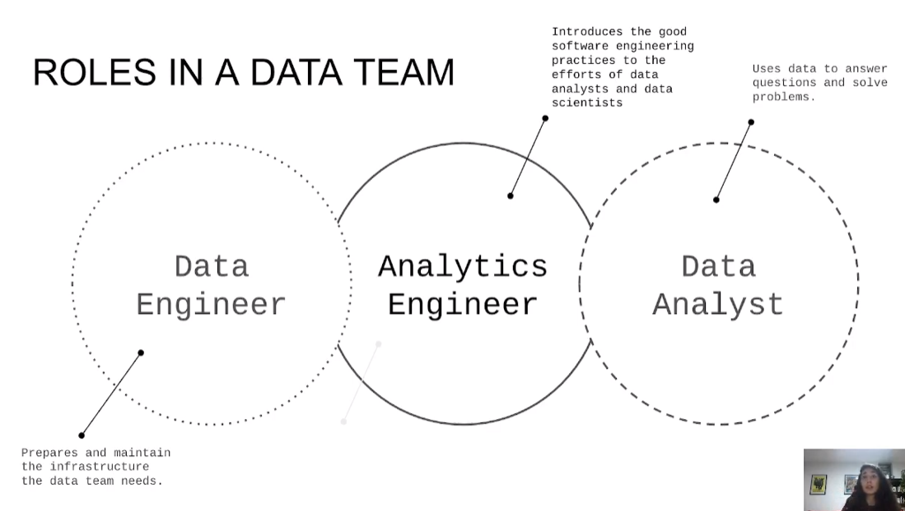
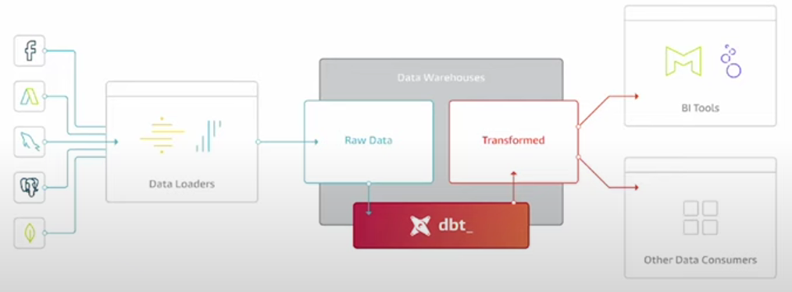
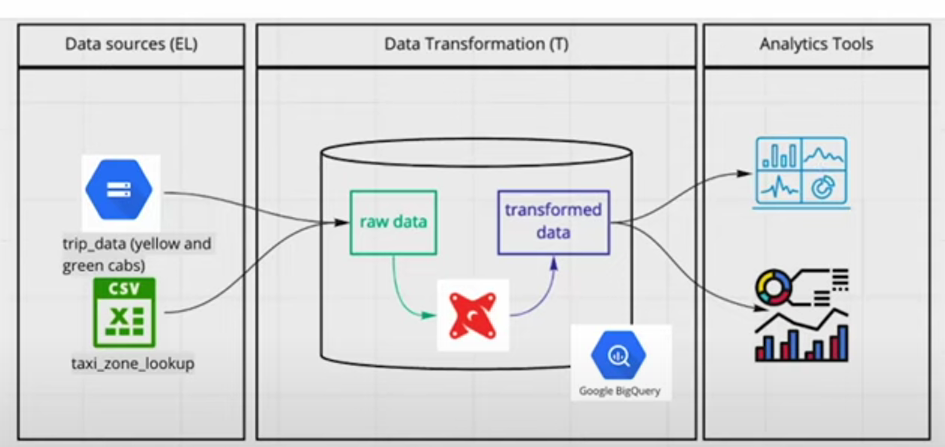
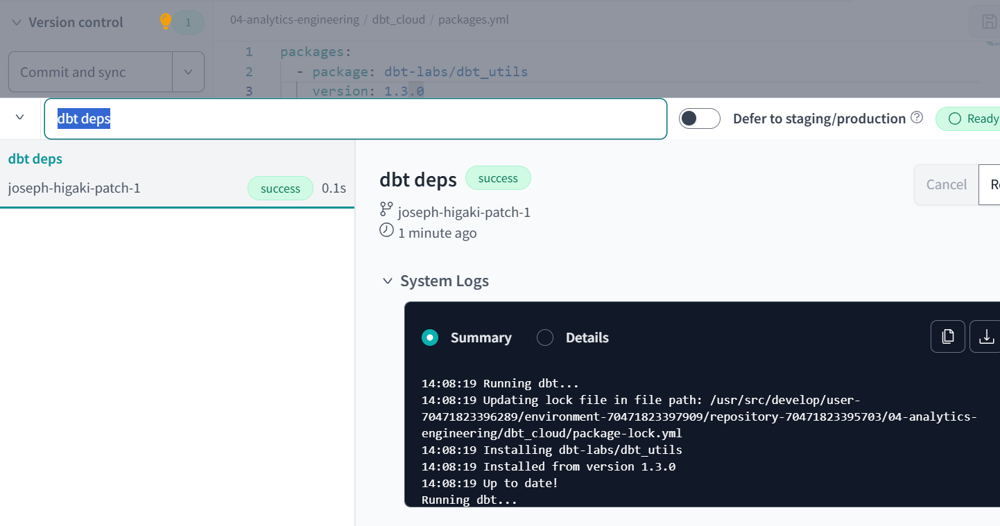

# Analytics Engineering

Fills in the gap in a data workflow
Good software engineers for the work the data analsts / scientists do

Data 
* Loading: 
* Storing: Snowflake, Bigquery, redshift
* Modelling: dbt, dataform
* PResentation: Looker, MOde, Tableau

## ETL ELT 

| ETL | ELT |
| --- | --- |
| First Transform before load | Load first |
| More often clean data | WHen you cannot afford to clean first or would take too much (time/effort) |
| Storage for cleaned datasets | More storage needed (cloud cheap storage as enabler) |
| Data is transformed outside | Data is transformed in the data lake or data warehouse |

## Modelling approach
Using Kimbells Dimensional Modelling
Others
- [Inmon](https://www.geeksforgeeks.org/difference-between-kimball-and-inmon/)
- [Data Vault](https://en.wikipedia.org/wiki/Data_vault_modeling)

## Elements

| Fact | Dimension |
| --- | --- |
| Metrics | Qualities |
| Business Processes | Context or CHaracteristic of Business Processs |
| Verbs | Nouns |
| e.g. Sales | e.g. Customer |

## Architecture of KImballs 

| Stage | Processing | PResentation |
| --- | --- |--- |
| Raw | Raw to data models  | Model to business stakeholder|
| Limited access. Only expert tech users| Exposed to people building data features / pielines | Access to Final Ussers |
| Ensures data exists | Ensures standards, qualiity and efficiancy | Ensures visibility / "presentability"? |

## dbt
Transformation workflow



Introduces good software engineering practices
* Develop
* Test and Document
* DEployment Ci/CD
* Version control
* DRY


**[Next dbt Setup](dbt_setup.md)**

### Macros

### Packages
https://hub.getdbt.com/
https://hub.getdbt.com/dbt-labs/dbt_utils/latest/
As soon as a package is added 

`dbt deps`runs automatically 



### Configuration 

This is the default behaviour
```sql
{{
    config(
        materialized='view'
    )
}}
```

We can override this as a table
[Sometimes in dev, a foler is a view and in prod is a table](https://youtu.be/ueVy2N54lyc?si=hYzcC3zzYwcxLB1_&t=1988)


### Variables

You can specify variable values at dbt run via CLI
```sql
-- dbt build --select <model_name> --vars '{'is_test_run': 'false'}'


  limit 100


```
