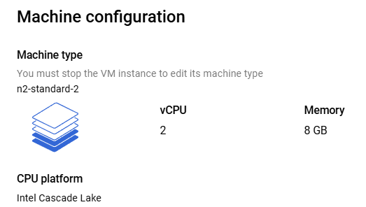
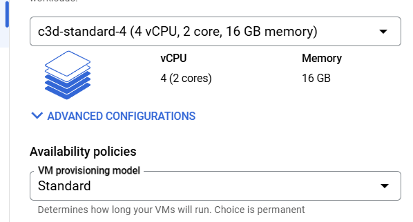

# Spin up large VM

## Background

SOmething to notice

```bash
24/12/02 08:22:27 INFO ResourceProfile: Default ResourceProfile created, executor resources: Map(cores -> name: cores, amount: 1, script: , vendor: , memory -> name: memory, amount: 1024, script: , vendor: , offHeap -> name: offHeap, amount: 0, script: , vendor: ), task resources: Map(cpus -> name: cpus, amount: 1.0)
```


I wanted to try if spinning up a larger VM (more than 1 core) would remove the warning


## Creation of VM Teraform script

```terraform
# This code is compatible with Terraform 4.25.0 and versions that are backwards compatible to 4.25.0.
# For information about validating this Terraform code, see https://developer.hashicorp.com/terraform/tutorials/gcp-get-started/google-cloud-platform-build#format-and-validate-the-configuration

resource "google_compute_instance" "spark-large" {
  boot_disk {
    auto_delete = true
    device_name = "spark-medium"

    initialize_params {
      image = "projects/debian-cloud/global/images/debian-12-bookworm-v20241112"
      size  = 120
      type  = "hyperdisk-balanced"
    }

    mode = "READ_WRITE"
  }

  can_ip_forward      = false
  deletion_protection = false
  enable_display      = false

  labels = {
    goog-ec-src           = "vm_add-tf"
    goog-ops-agent-policy = "v2-x86-template-1-3-0"
  }

  machine_type = "c3d-standard-4"

  metadata = {
    enable-osconfig = "TRUE"
  }

  name = "spark-large"

  network_interface {
    access_config {
      network_tier = "PREMIUM"
    }

    nic_type    = "GVNIC"
    queue_count = 0
    stack_type  = "IPV4_ONLY"
    subnetwork  = "projects/de-zoomcamp-jhigaki-course/regions/europe-west1/subnetworks/default"
  }

  scheduling {
    automatic_restart   = true
    on_host_maintenance = "TERMINATE"
    preemptible         = false
    provisioning_model  = "STANDARD"
  }

  service_account {
    email  = "1066985835377-compute@developer.gserviceaccount.com"
    scopes = ["https://www.googleapis.com/auth/devstorage.read_only", "https://www.googleapis.com/auth/logging.write", "https://www.googleapis.com/auth/monitoring.write", "https://www.googleapis.com/auth/service.management.readonly", "https://www.googleapis.com/auth/servicecontrol", "https://www.googleapis.com/auth/trace.append"]
  }

  shielded_instance_config {
    enable_integrity_monitoring = true
    enable_secure_boot          = false
    enable_vtpm                 = true
  }

  zone = "europe-west1-b"
}

module "ops_agent_policy" {
  source          = "github.com/terraform-google-modules/terraform-google-cloud-operations/modules/ops-agent-policy"
  project         = "de-zoomcamp-jhigaki-course"
  zone            = "europe-west1-b"
  assignment_id   = "goog-ops-agent-v2-x86-template-1-3-0-europe-west1-b"
  agents_rule = {
    package_state = "installed"
    version = "latest"
  }
  instance_filter = {
    all = false
    inclusion_labels = [{
      labels = {
        goog-ops-agent-policy = "v2-x86-template-1-3-0"
      }
    }]
  }
}

```

## Creating VM Instance from the command line
WHen I try to create [VM from command line](#create-vm-from-command-line)

Getting the error

```bash
ERROR: (gcloud.compute.instances.create) Could not fetch resource: - The user does not have access to service account '1066985835377-compute@developer.gserviceaccount.com'. User: 'multi-purpose-initial-sa@de-zoomcamp-jhigaki-course.iam.gserviceaccount.com'. Ask a project owner to grant you the iam.serviceAccountUser role on the service account 
```

TO solve this 

add the `iam.serviceAccountUser` to `multi-purpose-initial-sa@de-zoomcamp-jhigaki-course.iam.gserviceaccount.com`

```bash
gcloud projects add-iam-policy-binding de-zoomcamp-jhigaki-course \
    --member "serviceAccount:multi-purpose-initial-sa@de-zoomcamp-jhigaki-course.iam.gserviceaccount.com" \
    --role "roles/iam.serviceAccountUser"
```

iam.serviceAccountUser
## Create VM from command line
```bash
gcloud compute instances create spark-large \
    --project=de-zoomcamp-jhigaki-course \
    --zone=europe-west1-b \
    --machine-type=c3d-standard-4 \
    --network-interface=network-tier=PREMIUM,nic-type=GVNIC,stack-type=IPV4_ONLY,subnet=default \
    --metadata=enable-osconfig=TRUE \
    --maintenance-policy=TERMINATE \
    --provisioning-model=STANDARD \
    --service-account=1066985835377-compute@developer.gserviceaccount.com \
    --scopes=https://www.googleapis.com/auth/devstorage.read_only,https://www.googleapis.com/auth/logging.write,https://www.googleapis.com/auth/monitoring.write,https://www.googleapis.com/auth/service.management.readonly,https://www.googleapis.com/auth/servicecontrol,https://www.googleapis.com/auth/trace.append \
    --create-disk=auto-delete=yes,boot=yes,device-name=spark-medium,image=projects/debian-cloud/global/images/debian-12-bookworm-v20241112,mode=rw,provisioned-iops=3720,provisioned-throughput=320,size=120,type=hyperdisk-balanced \
    --no-shielded-secure-boot \
    --shielded-vtpm \
    --shielded-integrity-monitoring \
    --labels=goog-ops-agent-policy=v2-x86-template-1-3-0,goog-ec-src=vm_add-gcloud \
    --reservation-affinity=any \
&& \
printf 'agentsRule:\n  packageState: installed\n  version: latest\ninstanceFilter:\n  inclusionLabels:\n  - labels:\n      goog-ops-agent-policy: v2-x86-template-1-3-0\n' > config.yaml \
&& \
gcloud compute instances ops-agents policies create goog-ops-agent-v2-x86-template-1-3-0-europe-west1-b \
    --project=de-zoomcamp-jhigaki-course \
    --zone=europe-west1-b \
    --file=config.yaml
```


## Error after creation 
I couldn't start the agent policies 
`compute instances ops-agents policies`
```bash
NAME         ZONE            MACHINE_TYPE    PREEMPTIBLE  INTERNAL_IP  EXTERNAL_IP    STATUS
spark-large  europe-west1-b  c3d-standard-4               10.132.0.4   34.22.213.100  RUNNING
ERROR: (gcloud.compute.instances.ops-agents.policies.create) PERMISSION_DENIED: Permission 'osconfig.osPolicyAssignments.create' denied on resource '//osconfig.googleapis.com/projects/de-zoomcamp-jhigaki-course/locations/europe-west1-b' (or it may not exist). This command is authenticated as multi-purpose-initial-sa@de-zoomcamp-jhigaki-course.iam.gserviceaccount.com which is the active account specified by the [core/account] property.
- '@type': type.googleapis.com/google.rpc.ErrorInfo
  domain: osconfig.googleapis.com
  metadata:
    permission: osconfig.osPolicyAssignments.create
    resource: projects/de-zoomcamp-jhigaki-course/locations/europe-west1-b
  reason: IAM_PERMISSION_DENIED
```
I just ommitted the ops-agents step


## Install PySPark

Copy [install_spark.sh](install_spark.sh)  script
```bash
 scp /workspaces/data-engineering-zoomcamp/05-batch/install_spark.sh de-zoomcamp-spark-large:.
install_spark.sh   
```

```bash
ssh de-zoomcamp-spark-large
chmod +x install_spark.sh
./install_spark.sh
```

`jupyter notebook --port 9990`


## It Didn't remove the warning
```bash
24/12/02 10:07:19 WARN NativeCodeLoader: Unable to load native-hadoop library for your platform... using builtin-java classes where applicable
24/12/02 10:07:19 WARN DependencyUtils: Local jar /home/spark_jhigaki_gcp/~/spark/lib/gcs-connector-3.0.4.jar does not exist, skipping.
24/12/02 10:07:19 INFO SparkContext: Running Spark version 3.4.4
24/12/02 10:07:19 INFO ResourceUtils: ==============================================================
24/12/02 10:07:19 INFO ResourceUtils: No custom resources configured for spark.driver.
24/12/02 10:07:19 INFO ResourceUtils: ==============================================================
24/12/02 10:07:19 INFO SparkContext: Submitted application: test
24/12/02 10:07:19 INFO ResourceProfile: Default ResourceProfile created, executor resources: Map(cores -> name: cores, amount: 1, script: , vendor: , memory -> name: memory, amount: 1024, script: , vendor: , offHeap -> name: offHeap, amount: 0, script: , vendor: ), task resources: Map(cpus -> name: cpus, amount: 1.0)
```
I still get the meessage, only 1 cpu is used.
Still confused by that



