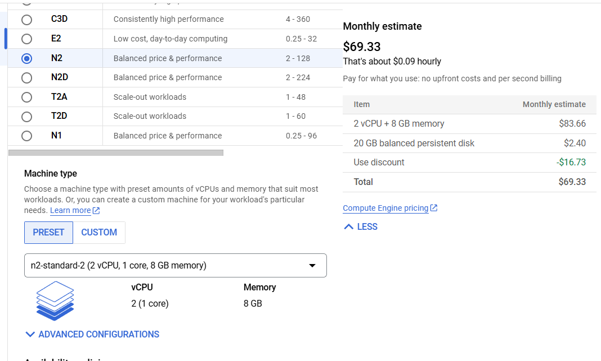

# Create VM



```bash
gcloud compute instances create spark_medium --project=de-zoomcamp-jhigaki-course --zone=europe-southwest1-a --machine-type=n2-standard-2 --network-interface=network-tier=PREMIUM,stack-type=IPV4_ONLY,subnet=default --maintenance-policy=MIGRATE --provisioning-model=STANDARD --service-account=1066985835377-compute@developer.gserviceaccount.com --scopes=https://www.googleapis.com/auth/devstorage.read_only,https://www.googleapis.com/auth/logging.write,https://www.googleapis.com/auth/monitoring.write,https://www.googleapis.com/auth/service.management.readonly,https://www.googleapis.com/auth/servicecontrol,https://www.googleapis.com/auth/trace.append --create-disk=auto-delete=yes,boot=yes,device-name=spark_medium,image=projects/debian-cloud/global/images/debian-12-bookworm-v20241112,mode=rw,size=20,type=pd-balanced --no-shielded-secure-boot --shielded-vtpm --shielded-integrity-monitoring --labels=goog-ec-src=vm_add-gcloud --reservation-affinity=any
```

```terraform
# This code is compatible with Terraform 4.25.0 and versions that are backwards compatible to 4.25.0.
# For information about validating this Terraform code, see https://developer.hashicorp.com/terraform/tutorials/gcp-get-started/google-cloud-platform-build#format-and-validate-the-configuration

resource "google_compute_instance" "spark_medium" {
  boot_disk {
    auto_delete = true
    device_name = "spark_medium"

    initialize_params {
      image = "projects/debian-cloud/global/images/debian-12-bookworm-v20241112"
      size  = 20
      type  = "pd-balanced"
    }

    mode = "READ_WRITE"
  }

  can_ip_forward      = false
  deletion_protection = false
  enable_display      = false

  labels = {
    goog-ec-src = "vm_add-tf"
  }

  machine_type = "n2-standard-2"
  name         = "spark_medium"

  network_interface {
    access_config {
      network_tier = "PREMIUM"
    }

    queue_count = 0
    stack_type  = "IPV4_ONLY"
    subnetwork  = "projects/de-zoomcamp-jhigaki-course/regions/europe-southwest1/subnetworks/default"
  }

  scheduling {
    automatic_restart   = true
    on_host_maintenance = "MIGRATE"
    preemptible         = false
    provisioning_model  = "STANDARD"
  }

  service_account {
    email  = "1066985835377-compute@developer.gserviceaccount.com"
    scopes = ["https://www.googleapis.com/auth/devstorage.read_only", "https://www.googleapis.com/auth/logging.write", "https://www.googleapis.com/auth/monitoring.write", "https://www.googleapis.com/auth/service.management.readonly", "https://www.googleapis.com/auth/servicecontrol", "https://www.googleapis.com/auth/trace.append"]
  }

  shielded_instance_config {
    enable_integrity_monitoring = true
    enable_secure_boot          = false
    enable_vtpm                 = true
  }

  zone = "europe-southwest1-a"
}

```

Acces the console:

`ssh de-zoomcamp-spark-instance`


```bash
mkdir spark
cd spark
```


`wget https://repo.anaconda.com/archive/Anaconda3-2024.10-1-Linux-x86_64.sh`

`bash Anaconda3-2024.10-1-Linux-x86_64.sh `

Anaconda3 will now be installed into this location:
/home/spark_jhigaki_gcp/anaconda3

https://docs.anaconda.com/anaconda/advanced-install/silent-mode/
For conda to install in silent mode: needs to be initialized in bshrc
`diff before_conda_.bashrc after_conda_.bashrc`
```bash
> # >>> conda initialize >>>
> # !! Contents within this block are managed by 'conda init' !!
> __conda_setup="$('/home/spark_jhigaki_gcp/anaconda3/bin/conda' 'shell.bash' 'hook' 2> /dev/null)"
> if [ $? -eq 0 ]; then
>     eval "$__conda_setup"
> else
>     if [ -f "/home/spark_jhigaki_gcp/anaconda3/etc/profile.d/conda.sh" ]; then
>         . "/home/spark_jhigaki_gcp/anaconda3/etc/profile.d/conda.sh"
>     else
>         export PATH="/home/spark_jhigaki_gcp/anaconda3/bin:$PATH"
>     fi
> fi
> unset __conda_setup
> # <<< conda initialize <<<
> 
```
Delete anaconda isntaller
`rm Anaconda3-2024.10-1-Linux-x86_64.sh`

downgrade python
`conda install python=3.11`

download java
`wget https://download.java.net/java/GA/jdk11/9/GPL/openjdk-11.0.2_linux-x64_bin.tar.gz`
unapsk java
`tar xzfv openjdk-11.0.2_linux-x64_bin.tar.gz`

set vars
```
export JAVA_HOME="${HOME}/spark/jdk-11.0.2"
export PATH="${JAVA_HOME}/bin:${PATH}"
```

spark
```
wget https://dlcdn.apache.org/spark/spark-3.4.4/spark-3.4.4-bin-hadoop3.tgz
 
 tar xzfv spark-3.4.4-bin-hadoop3.tgz

rm spark-3.4.4-bin-hadoop3.tgz
```
set vars
```
export SPARK_HOME="${HOME}/spark/spark-3.4.4-bin-hadoop3"
export PATH="${SPARK_HOME}/bin:${PATH}"
export PYTHONPATH="/home/spark_jhigaki_gcp/anaconda3/bin/python"
export PYTHONPATH="${SPARK_HOME}/python/lib/py4j-0.10.9.7-src.zip:${SPARK_HOME}/python/:$PYTHONPATH"
```

start jupyter at 8890
`jupyter notebook --port 8890`

forward port 8890

`ssh -L 8890:localhost:8890 spark_jhigaki_gcp@de-zoomcamp-spark-medium`


set bashrc to keep env variables for pyspark
```bash
echo '# Set Spark and PySpark env variables' >> ~/.bashrc
echo 'export JAVA_HOME="${HOME}/spark/jdk-11.0.2"' >> ~/.bashrc
echo 'export SPARK_HOME="${HOME}/spark/spark-3.4.4-bin-hadoop3"' >> ~/.bashrc
echo 'export PATH="${JAVA_HOME}/bin:${SPARK_HOME}/bin:${PATH}"' >> ~/.bashrc
echo 'export PYTHONPATH="/home/spark_jhigaki_gcp/anaconda3/bin/python"' >> ~/.bashrc
echo 'export PYTHONPATH="${SPARK_HOME}/python/lib/py4j-0.10.9.7-src.zip:${SPARK_HOME}/python/:$PYTHONPATH"' >> ~/.bashrc
```

forward spark jobs ports 

`ssh -L 4040:localhost:4040 spark_jhigaki_gcp@de-zoomcamp-spark-medium`
