# install spark


## install spark on my dev container
export PATH="${JAVA_HOME}/bin:${SPARK_HOME}/bin:${PATH}"
export PYTHONPATH="$PYTHON_PATH"
export PYTHONPATH="${SPARK_HOME}/python/:$PYTHONPATH"
export PYTHONPATH="${SPARK_HOME}/python/lib/py4j-0.10.9.7-src.zip:/:$PYTHONPATH"

And it works

need to do this every time, as I've not addded this to the .bashrc or on load events of the container


### INstall Java

Version 11

Note on SPark reqs:

    [Spark runs on Java 8/11/17, Scala 2.12/2.13, Python 3.8+, and R 3.5+.](https://spark.apache.org/docs/3.5.3/#:~:text=Spark%20runs%20on%20Java%208,that%20Spark%20was%20compiled%20for.) Java 8 prior to version 8u371 support is deprecated as of Spark 3.5.0. When using the Scala API, it is necessary for applications to use the same version of Scala that Spark was compiled for. For example, when using Scala 2.13, use Spark compiled for 2.13, and compile code/applications for Scala 2.13 as well.

    For Java 11, setting -Dio.netty.tryReflectionSetAccessible=true is required for the Apache Arrow library. This prevents the java.lang.UnsupportedOperationException: sun.misc.Unsafe or java.nio.DirectByteBuffer.(long, int) not available error when Apache Arrow uses Netty internally

It looks like I already have java and spark
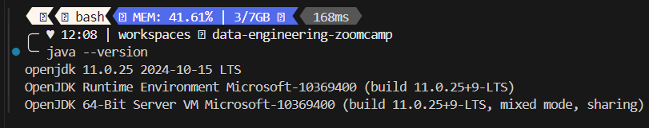

I can start `spark-shell`
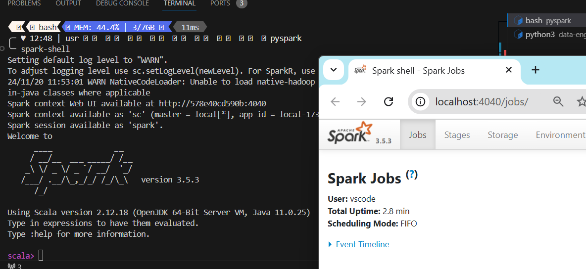

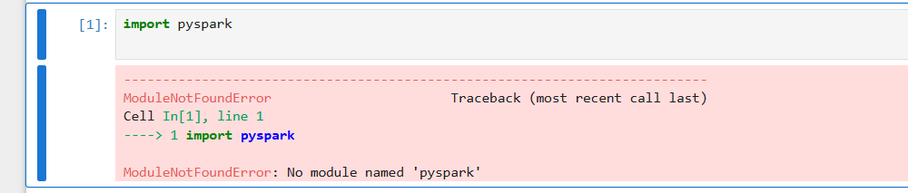

Missing Steps:
```bash
export PYTHONPATH="${SPARK_HOME}/python/:$PYTHONPATH"
export PYTHONPATH="${SPARK_HOME}/python/lib/py4j-0.10.9-src.zip:$PYTHONPATH"
```

executint `printenv` it shows
```bash
...
PYTHON_PATH=/usr/local/python/current
...
```

export PYSPARK_PYTHON=$PYTHONPATH

Not sure how my dev container locates python
```bash
╰─ whereis python
python: 
    /usr/bin/python3.9 
    /usr/lib/python2.7 
    /usr/lib/python3.9 
    /etc/python3.9 
    /usr/local/lib/python3.9 
    /usr/local/python 
    /opt/az/bin/python3.11 
    /opt/az/bin/python3.11-config 
    /usr/local/python/3.9.20/bin/python3.9 
    /usr/local/python/3.9.20/bin/python3.9-config 
    /usr/local/python/3.9.20/bin/python

    ╰─ whereis python

/usr/bin/python3.9
 /usr/lib/python2.7 
 /usr/lib/python3.9 
 /etc/python3.9 
 /usr/local/lib/python3.9 
 /usr/local/python 
 /opt/az/bin/python3.11 
 /opt/az/bin/python3.11-config 
 /usr/local/python/3.9.20/bin/python3.9 
 /usr/local/python/3.9.20/bin/python3.9-config 
 /usr/local/python/3.9.20/bin/python
```

It might be a typo

I'm going to export `PYTHONPATH ` NO UNDERSCORES without initilaizing to the 
`PYTHON_PATH=/usr/local/python/current`


FIgure out my py4j version filename:
```bash
cd ${SPARK_HOME}/python/lib
ls
py4j-0.10.9.7-src.zip  PY4J_LICENSE.txt  pyspark.zip
```

Now Export both
```bash
export PYTHONPATH="${SPARK_HOME}/python/:$PYTHONPATH"
export PYTHONPATH="${SPARK_HOME}/python/lib/py4j-0.10.9.7-src.zip:$PYTHONPATH"
```


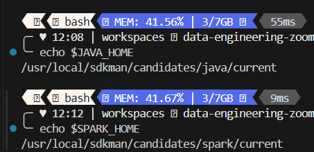


export SPARK_HOME='/opt/spark2.4'
`echo $SPARK_HOME /usr/local/sdkman/candidates/spark/current`

export PYTHONPATH=$SPARK_HOME/python:$PYTHONPATH 
```bash
echo $PYTHONPATH
/usr/local/sdkman/candidates/spark/current/python/lib/py4j-0.10.9.7-src.zip
:
/usr/local/sdkman/candidates/spark/current/python/
:
/usr/local/python/current
```
export PYSPARK_DRIVER_PYTHON="jupyter"
export PYSPARK_DRIVER_PYTHON_OPTS="notebook"
export PYSPARK_PYTHON=python3
export PATH=
$SPARK_HOME no
:$PATH
:~/.local/bin no
:$JAVA_HOME/bin yes 
:$JAVA_HOME/jre/bin don't have

/home/vscode/.asdf/shims
/home/vscode/.asdf/bin
/usr/local/sdkman/candidates/spark/current/bin
/vscode/vscode-server/bin/linux-x64/f1a4fb101478ce6ec82fe9627c43efbf9e98c813/bin/remote-cli
/home/vscode/.local/bin
/home/vscode/bin
/usr/local/sdkman/bin
/usr/local/sdkman/bin
/usr/local/sdkman/candidates/java/current/bin
/usr/local/sdkman/candidates/gradle/current/bin
/usr/local/sdkman/candidates/maven/current/bin
/usr/local/sdkman/candidates/ant/current/bin
/usr/local/python/current/bin
/usr/local/py-utils/bin
/usr/local/share/nvm/versions/node/v20.18.0/bin
/usr/local/go/bin
/go/bin
/go/bin
/usr/local/go/bin
/usr/local/sbin
/usr/local/bin
/usr/sbin
/usr/bin
/sbin
/bin
/usr/local/pwsh
/home/vscode/bin


export PATH="$SPARK_HOME:$PATH"
Change the directories according to your enviroment, and the s

CANNOT


## install spark on _____CLOUD?_____

### INstall Google CLoud CLI
https://cloud.google.com/compute/docs/connect/create-ssh-keys#gcloud
(already in my dev container)

─ gcloud config list
[core]
disable_usage_reporting = True

Your active configuration is: [default]


ssh-keygen -t rsa -f ~/.ssh/KEY_FILENAME -C USERNAME

```bash
cd ~/.ssh
ssh-keygen -t rsa -f ~/.ssh/spark_jhigaki_gcp_key -C spark_jhigaki_gcp
```

Upload the ssh PUB key at Compute Engine / Metadata 
https://console.cloud.google.com/compute/metadata?hl=en&invt=Abh7pw&project=de-zoomcamp-jhigaki-course&supportedpurview=organizationId&scopeTab=projectMetadata


Create Instance
https://console.cloud.google.com/compute/instances?hl=en&invt=Abh7pw&project=de-zoomcamp-jhigaki-course&supportedpurview=organizationId 

external ip: 34.175.206.91

`ssh -i ~/.ssh/spark_jhigaki_gcp_key spark_jhigaki_gcp@34.175.206.91`


### Make a config file for easy connect

```bash
Host de-zoomcamp-spark-instance
    HostName 34.175.206.91
    User spark_jhigaki_gcp
    IdentityFile ~/.ssh/spark_jhigaki_gcp_key
```

`cp /workspaces/data-engineering-zoomcamp/05-batch/config ~/.ssh/config`

it works the shorter version
`ssh de-zoomcamp-spark-instance`

### Install Java
DOwnload
wget https://download.java.net/java/GA/jdk11/9/GPL/openjdk-11.0.2_linux-x64_bin.tar.gz
     
    
Unpack
tar xzfv openjdk-11.0.2_linux-x64_bin.tar.gz

ADd Java to PATH
```bash
export JAVA_HOME="${HOME}/spark/jdk-11.0.2"
export PATH="${JAVA_HOME}/bin:${PATH}"
```

### Install python conda

wget https://repo.anaconda.com/archive/Anaconda3-2024.10-1-Linux-x86_64.sh

https://repo.anaconda.com/archive/Anaconda3-2024.10-1-Linux-x86_64.sh

https://anaconda.org/anaconda/python/3.11.9/download/linux-64/python-3.11.9-h955ad1f_0.tar.bz2


bash Anaconda3-2024.10-1-Linux-x86_64.sh


saw this [compatibility matrix](https://community.cloudera.com/t5/Community-Articles/Spark-Python-Supportability-Matrix/ta-p/379144)
 ``conda install python=3.11`

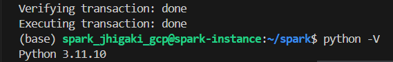


I can start Jupyter notebook
`ssh de-zoomcamp-spark-instance`

`jupyter notebook`
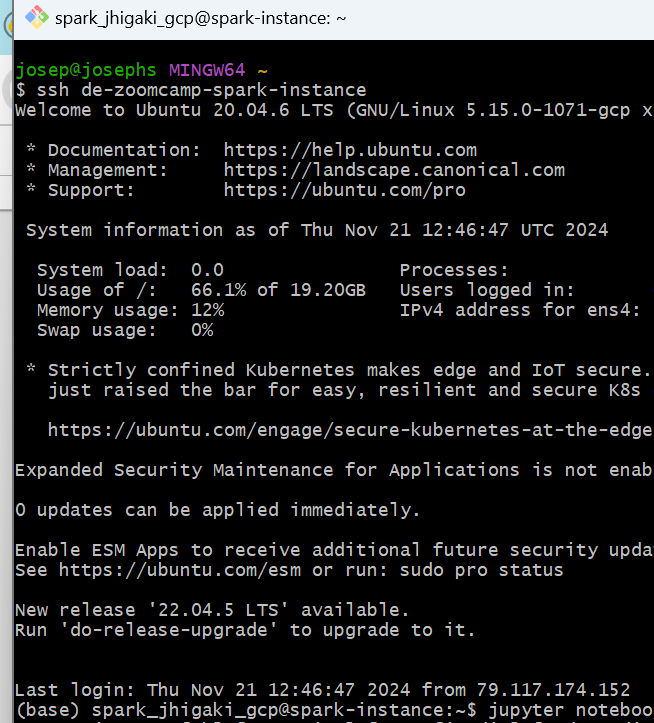


From my local machin, i forward a port 

`ssh -L 8888:localhost:8888 spark_jhigaki_gcp@de-zoomcamp-spark-instance`
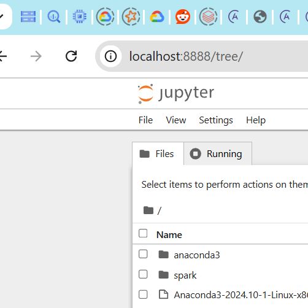

### Install Spark
Grab the spark link
`wget https://dlcdn.apache.org/spark/spark-3.4.4/spark-3.4.4-bin-hadoop3.tgz`

` tar xzfv spark-3.4.4-bin-hadoop3.tgz`

` rm spark-3.4.4-bin-hadoop3.tgz`

```bash
export SPARK_HOME="${HOME}/spark/spark-3.4.4-bin-hadoop3"
export PATH="${SPARK_HOME}/bin:${PATH}"
```

start Spark

`spark-shell`
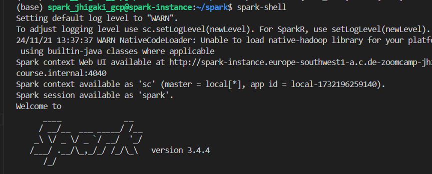

Forward port from my local machine
`ssh -L 4040:localhost:4040 spark_jhigaki_gcp@de-zoomcamp-spark-instance`
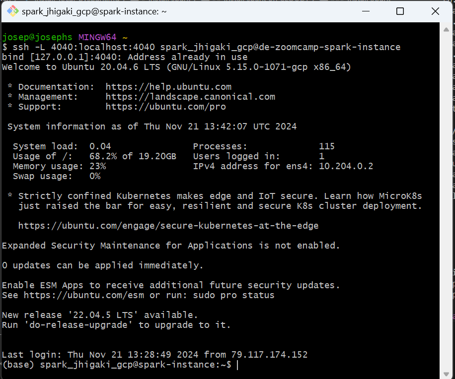

Spark works: 
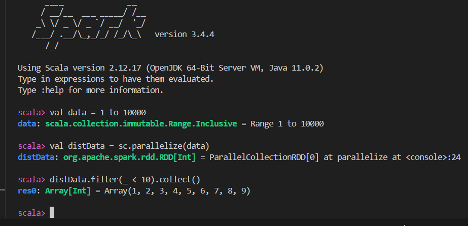 

 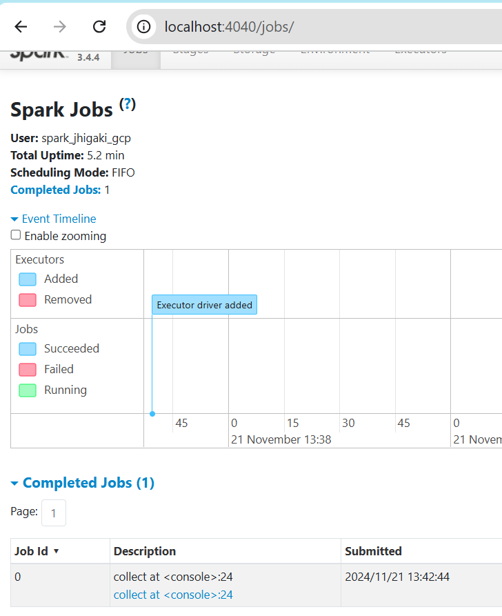

 ### Install Pyspark

```bash
 export PYTHONPATH="${SPARK_HOME}/python/:$PYTHONPATH"
export PYTHONPATH="${SPARK_HOME}/python/lib/py4j-0.10.9.7-src.zip:$PYTHONPATH"
```

restart Jupyter Notebook

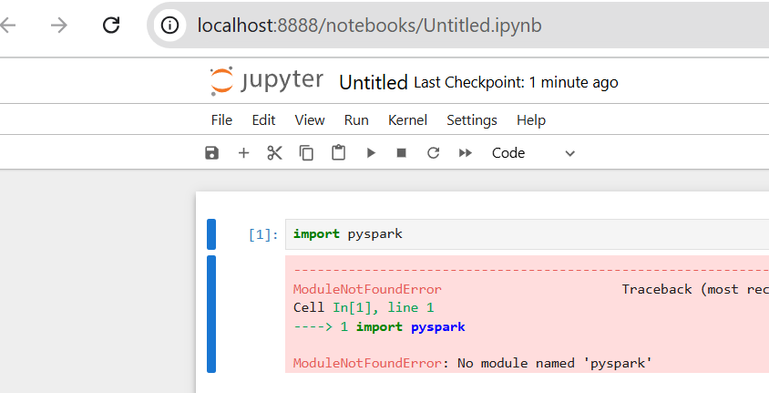
DOESNT WORK AGAIN

```bash
(base) spark_jhigaki_gcp@spark-instance:~/spark$ which pyspark
/home/spark_jhigaki_gcp/spark/spark-3.4.4-bin-hadoop3/bin/pyspark

(base) spark_jhigaki_gcp@spark-instance:~/spark$ printenv PYTHONPATH
/home/spark_jhigaki_gcp/spark/spark-3.4.4-bin-hadoop3/python/lib/py4j-0.10.9.7-src.zip:
/home/spark_jhigaki_gcp/spark/spark-3.4.4-bin-hadoop3/python/:
/home/spark_jhigaki_gcp/spark/spark-3.4.4-bin-hadoop3/python/:

(base) spark_jhigaki_gcp@spark-instance:~/spark$ printenv PATH
/home/spark_jhigaki_gcp/spark/jdk-11.0.2/bin:
/home/spark_jhigaki_gcp/spark/spark-3.4.4-bin-hadoop3/bin:
/home/spark_jhigaki_gcp/anaconda3/bin:/home/spark_jhigaki_gcp/anaconda3/condabin:
/usr/local/sbin:
/usr/local/bin:/usr/sbin:/usr/bin:/sbin:/bin:/usr/games:/usr/local/games:/snap/bin

(base) spark_jhigaki_gcp@spark-instance:~/spark$ which jupyter
/home/spark_jhigaki_gcp/anaconda3/bin/jupyter

(base) spark_jhigaki_gcp@spark-instance:~/spark$ which python
/home/spark_jhigaki_gcp/anaconda3/bin/python

(base) spark_jhigaki_gcp@spark-instance:~/spark$ 
```


*****EUREKA***** 

#### Ensuring env variables

Since Env variables are not persisted between SSH sessions
* I was starting jupyter notebook on a ssh session where SPARK_HOME nor JAVA_HOME nor PYTHON PATH were set

They need to be

### Ensuring env variables are set for the user
Editin `~/.bashrc` so the spark env variables are always set
```bash
echo '# Set Spark and PySpark env variables' >> ~/.bashrc
echo 'export JAVA_HOME="${HOME}/spark/jdk-11.0.2"' >> ~/.bashrc
echo 'export SPARK_HOME="${HOME}/spark/spark-3.4.4-bin-hadoop3"' >> ~/.bashrc
echo 'export PATH="${JAVA_HOME}/bin:${SPARK_HOME}/bin:${PATH}"' >> ~/.bashrc
echo 'export PYTHONPATH="${SPARK_HOME}/python/lib/py4j-0.10.9.7-src.zip:${SPARK_HOME}/python/:$PYTHONPATH"' >> ~/.bashrc
```

For now, if I start jupyter notebook, since the env variables are already set at `.bashrc` I can do `import pyspark`


~I WISH I COULD CONNECT MY IPYNB NOTEBOOK FROM VS CODE, TO MY REMOTE SPARK (gcp vm instance)~

Connecting to the pykernel of the vs.code python notebook: 
1. I think I was missing the extension python + Jupyter
2. When entering the Jupyter server URL. Remember you need to forward the port first: 
Executing this in the terminal of the dev container: 
` ssh -L 8891:localhost:8888 spark_jhigaki_gcp@de-zoomcamp-spark-instance`

here notice that jupyter noteboook is running @ de-zoomcamp-spark-instance in port 8888
And it is forwarded to port 8891 from the dev container
