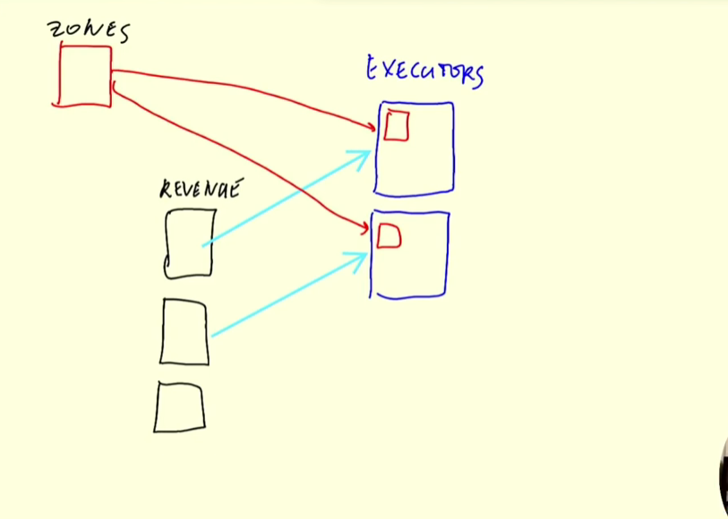

# Batch - SPark

## Install local Spark
 [Install Spark / PySpark](install_local_pyspark.md#install-spark-on-my-dev-container) at the dev containr

And testing if [it works](./testing_dev_container_spark.ipynb)

## Installed GCP VM Spark
Install Spark [at GCP CLoud](install_local_pyspark.md#install-spark-on-gcp-cloud)

Testing [here](./testing_gcp_vm_spark.ipynb)

## 01 Jupyter Notebook Spark 
Running a cloud VM: `de-zoomcamp-jhigaki-course` `spark-instance` on `europe-southwest1-a`
Installed:
* [Java ](./install_local_pyspark.md#install-java-1)  openjdk-11.0.2
* [anaconda](./install_local_pyspark.md#install-python-conda)  Anaconda3-2024.10-1-Linux-x86_64
* Python 3.11 
* [Spark](./install_local_pyspark.md#install-spark-1) 3.4.4

### [01 Taxi Rides Spark Notebook](./01_taxy_rides_spark.ipynb)
Based on [lecture](https://www.youtube.com/watch?v=ti3aC1m3rE8&list=PL3MmuxUbc_hJed7dXYoJw8DoCuVHhGEQb&index=55)
* Reading local parquet
* Eexecuting tasks
* saving partitioned parquet files to disk

## 02 [Read and Repartition](./02_taxi_rides_spark.ipynb)
Based on lectures [5.3.3](https://www.youtube.com/watch?v=CI3P4tAtru4&list=PL3MmuxUbc_hJed7dXYoJw8DoCuVHhGEQb&index=56) and [5.3.4](https://www.youtube.com/watch?v=uAlp2VuZZPY&list=PL3MmuxUbc_hJed7dXYoJw8DoCuVHhGEQb&index=57)

* download parquet yellow, green and fhv 2020 from command line into `raw` flat 
`chmod +x download_nyc_tripdata.sh`
`chmod +x download_2019_2020_all.sh`
`./download_2019_2020_all.sh`


* Reading local parquet
* write as parquet files in folders as `raw/data-lake-format/<service-type>/<year>/<month>` 

## 03 [Transformations and SQL](./03_taxi_rides_spark.ipynb)
BAsed on LEctures [5.3.4](https://www.youtube.com/watch?v=uAlp2VuZZPY&list=PL3MmuxUbc_hJed7dXYoJw8DoCuVHhGEQb&index=57)
and course files 
* [04_pyspark](https://github.com/DataTalksClub/data-engineering-zoomcamp/blob/main/05-batch/code/04_pyspark.ipynb)
* [05_taxi_schema](https://github.com/DataTalksClub/data-engineering-zoomcamp/blob/main/05-batch/code/05_taxi_schema.ipynb)
* [06_spark_sql](https://github.com/DataTalksClub/data-engineering-zoomcamp/blob/main/05-batch/code/06_spark_sql.ipynb)

* Union files (green & yelllow)
* add service type column
* udf spark function (date comment function)
* execute sql

## 04 [Group By SPark](./04_taxi_rides_spark.ipynb)
BAsed on LEctures [5.4.1](https://www.youtube.com/watch?v=68CipcZt7ZA&list=PL3MmuxUbc_hJed7dXYoJw8DoCuVHhGEQb&index=58)
[5.4.2](https://www.youtube.com/watch?v=9qrDsY_2COo&list=PL3MmuxUbc_hJed7dXYoJw8DoCuVHhGEQb&index=59)

*GROUP BY*

- group by sum trip count, passenger count. IN SPARK
- join by something with high cardinality
- trips in the same hour window, zone, sum amount
    - Be consious about re-shuffling
    - grouping and aggregating are done distributed
        
    - See the difference between with and WITHOUT order by
- Generate revenue report by hour, service type
- Write to parquet
- BE aware of file amount and fiel size
- Re-shuffle as little as possible 
- after 


## 05 [Join n REpartition](./05_taxi_rides_spark.ipynb)
From lecture [5.4.3](https://www.youtube.com/watch?v=lu7TrqAWuH4&list=PL3MmuxUbc_hJed7dXYoJw8DoCuVHhGEQb&index=60)
- Load from parquet the revenue yellow and green
- no repartition - Join service type side to side
- repartition - Join service type side to side
https://www.youtube.com/watch?v=lu7TrqAWuH4&list=PL3MmuxUbc_hJed7dXYoJw8DoCuVHhGEQb&index=60

- Join small tables. Broadcast exchange

This is faster than doing a merge sort exchange

The entire zone table is sent to each executor, and there it is looked up

See article [sort merge vs broadcast](https://medium.com/swlh/spark-joins-tuning-part-1-sort-merge-vs-broadcast-a98d82610cf0)


## 06 [RDDs map and reduce](./06_taxi_rides_spark.ipynb)
Most of the time we don't need to use RDDs
- do map / reduce  

## 07 [RDDs mapPartitions](./07_taxi_rides_spark.ipynb07)
Use map when the transformation logic is straightforward and can be applied independently to each element without requiring context from other elements or partitions.

Use mapPartitions when the transformation requires setup or teardown of resources (like database connections) that are expensive to initialize for each element but can be shared across elements within the same partition.

skip to nexttm, spark with gcs 

## 08 Spark with GCS

* Connect to GCS
- [read GCS Bucket](./08_taxi_rides_spark.ipynb)


## 09 Spark with GCS write
* Connect to GCS
- [read and write  Bucket](./09_taxi_rides_spark.ipynb)
Had a lot of issues. seee [folder](./spark_gcp_specific_credentials_tests/)
[**Conclusion here**](./spark_gcp_specific_credentials_tests/unsucsessful_spark_credentials_specification.md#conclusion)


## 09.01 SPark Standalone

* [Testing Juypyter Notebook to Standalone Spark ](./09-01_taxi_rides_spark.ipynb)
* [Script with hardcoded read/write paths](./09-01_taxi_rides_spark.py)
* [Script with parmas read/write paths](./09-01_taxi_rides_spark_params.py)

### [Starting a SPark Cluster Manually](https://spark.apache.org/docs/3.5.3/spark-standalone.html#starting-a-cluster-manually)

### Start Spark Master 
From GCP VM
`$SPARK_HOME/sbin/start-master.sh --port 7077 --webui-port 9090`
By Default it started a spark UI in port: 8080, sending it to 9090

Command result
`starting org.apache.spark.deploy.master.Master, logging to /home/spark_jhigaki_gcp/spark/spark-3.4.4-bin-hadoop3/logs/spark-spark_jhigaki_gcp-org.apache.spark.deploy.master.Master-1-spark-medium.out`

See log
`cat /home/spark_jhigaki_gcp/spark/spark-3.4.4-bin-hadoop3/logs/spark-spark_jhigaki_gcp-org.apache.spark.deploy.master.Master-1-spark-medium.out`

```bash
Spark Command: /home/spark_jhigaki_gcp/spark/jdk-11.0.2/bin/java -cp /home/spark_jhigaki_gcp/spark/spark-3.4.4-bin-hadoop3/conf/:/home/spark_jhigaki_gcp/spark/spark-3.4.4-bin-hadoop3/jars/* -Xmx1g org.apache.spark.deploy.master.Master --host spark-medium.europe-southwest1-a.c.de-zoomcamp-jhigaki-course.internal --port 7077 --webui-port 8080
========================================
Using Spark's default log4j profile: org/apache/spark/log4j2-defaults.properties
24/12/02 12:26:41 INFO Master: Started daemon with process name: 11787@spark-medium
24/12/02 12:26:41 INFO SignalUtils: Registering signal handler for TERM
24/12/02 12:26:41 INFO SignalUtils: Registering signal handler for HUP
24/12/02 12:26:41 INFO SignalUtils: Registering signal handler for INT
24/12/02 12:26:42 WARN NativeCodeLoader: Unable to load native-hadoop library for your platform... using builtin-java classes where applicable
24/12/02 12:26:42 INFO SecurityManager: Changing view acls to: spark_jhigaki_gcp
24/12/02 12:26:42 INFO SecurityManager: Changing modify acls to: spark_jhigaki_gcp
24/12/02 12:26:42 INFO SecurityManager: Changing view acls groups to: 
24/12/02 12:26:42 INFO SecurityManager: Changing modify acls groups to: 
24/12/02 12:26:42 INFO SecurityManager: SecurityManager: authentication disabled; ui acls disabled; users with view permissions: spark_jhigaki_gcp; groups with view permissions: EMPTY; users with modify permissions: spark_jhigaki_gcp; groups with modify permissions: EMPTY
24/12/02 12:26:42 INFO Utils: Successfully started service 'sparkMaster' on port 7077.
24/12/02 12:26:42 INFO Master: Starting Spark master at spark://spark-medium.europe-southwest1-a.c.de-zoomcamp-jhigaki-course.internal:7077
24/12/02 12:26:42 INFO Master: Running Spark version 3.4.4
24/12/02 12:26:42 INFO JettyUtils: Start Jetty 0.0.0.0:8080 for MasterUI
24/12/02 12:26:42 INFO Utils: Successfully started service 'MasterUI' on port 8080.
24/12/02 12:26:43 INFO MasterWebUI: Bound MasterWebUI to 0.0.0.0, and started at http://spark-medium.europe-southwest1-a.c.de-zoomcamp-jhigaki-course.internal:8080
24/12/02 12:26:43 INFO Master: I have been elected leader! New state: ALIVE
```


### Forward Port 
8080 from GCP VM to  Dev container 4080
`ssh -L 4080:localhost:8080 de-zoomcamp-spark-medium`

4080 Dev container to Win Host 4080

`added manually in vs.code terminal` 

This is because I was already running `8080` in the container and forwarded to Win Host for Airflow UI

### Accessing standalone SPark UI 


URL: `spark://spark-medium.europe-southwest1-a.c.de-zoomcamp-jhigaki-course.internal:7077`

If I try to read / show: EXECUTE

Get an error pbecause we have no executers (Workers)

```bash
24/12/02 12:52:15 WARN MetricsConfig: Cannot locate configuration: tried hadoop-metrics2-google-hadoop-file-system.properties,hadoop-metrics2.properties
24/12/02 12:52:32 WARN TaskSchedulerImpl: Initial job has not accepted any resources; check your cluster UI to ensure that workers are registered and have sufficient resources
24/12/02 12:52:47 WARN TaskSchedulerImpl: Initial job has not accepted any resources; check your cluster UI to ensure that workers are registered and have sufficient resources
```


### Start Spark Worker
From GCP VM
`$SPARK_HOME/sbin/start-worker.sh spark://spark-medium.europe-southwest1-a.c.de-zoomcamp-jhigaki-course.internal:7077`

Result
`starting org.apache.spark.deploy.worker.Worker, logging to /home/spark_jhigaki_gcp/spark/spark-3.4.4-bin-hadoop3/logs/spark-spark_jhigaki_gcp-org.apache.spark.deploy.worker.Worker-1-spark-medium.out`

```bash
Spark Command: /home/spark_jhigaki_gcp/spark/jdk-11.0.2/bin/java -cp /home/spark_jhigaki_gcp/spark/spark-3.4.4-bin-hadoop3/conf/:/home/spark_jhigaki_gcp/spark/spark-3.4.4-bin-hadoop3/jars/* -Xmx1g org.apache.spark.deploy.worker.Worker --webui-port 8081 spark://spark-medium.europe-southwest1-a.c.de-zoomcamp-jhigaki-course.internal:7077
========================================
Using Spark's default log4j profile: org/apache/spark/log4j2-defaults.properties
24/12/02 12:55:55 INFO Worker: Started daemon with process name: 14142@spark-medium
24/12/02 12:55:55 INFO SignalUtils: Registering signal handler for TERM
24/12/02 12:55:55 INFO SignalUtils: Registering signal handler for HUP
24/12/02 12:55:55 INFO SignalUtils: Registering signal handler for INT
24/12/02 12:55:55 WARN NativeCodeLoader: Unable to load native-hadoop library for your platform... using builtin-java classes where applicable
24/12/02 12:55:56 INFO SecurityManager: Changing view acls to: spark_jhigaki_gcp
24/12/02 12:55:56 INFO SecurityManager: Changing modify acls to: spark_jhigaki_gcp
24/12/02 12:55:56 INFO SecurityManager: Changing view acls groups to: 
24/12/02 12:55:56 INFO SecurityManager: Changing modify acls groups to: 
24/12/02 12:55:56 INFO SecurityManager: SecurityManager: authentication disabled; ui acls disabled; users with view permissions: spark_jhigaki_gcp; groups with view permissions: EMPTY; users with modify permissions: spark_jhigaki_gcp; groups with modify permissions: EMPTY
24/12/02 12:55:56 INFO Utils: Successfully started service 'sparkWorker' on port 32981.
24/12/02 12:55:56 INFO Worker: Worker decommissioning not enabled.
24/12/02 12:55:56 INFO Worker: Starting Spark worker 10.204.0.4:32981 with 2 cores, 6.8 GiB RAM
24/12/02 12:55:56 INFO Worker: Running Spark version 3.4.4
24/12/02 12:55:56 INFO Worker: Spark home: /home/spark_jhigaki_gcp/spark/spark-3.4.4-bin-hadoop3
24/12/02 12:55:56 INFO ResourceUtils: ==============================================================
24/12/02 12:55:56 INFO ResourceUtils: No custom resources configured for spark.worker.
24/12/02 12:55:56 INFO ResourceUtils: ==============================================================
24/12/02 12:55:57 INFO JettyUtils: Start Jetty 0.0.0.0:8081 for WorkerUI
24/12/02 12:55:57 INFO Utils: Successfully started service 'WorkerUI' on port 8081.
24/12/02 12:55:57 INFO WorkerWebUI: Bound WorkerWebUI to 0.0.0.0, and started at http://spark-medium.europe-southwest1-a.c.de-zoomcamp-jhigaki-course.internal:8081
24/12/02 12:55:57 INFO Worker: Connecting to master spark-medium.europe-southwest1-a.c.de-zoomcamp-jhigaki-course.internal:7077...
24/12/02 12:55:57 INFO TransportClientFactory: Successfully created connection to spark-medium.europe-southwest1-a.c.de-zoomcamp-jhigaki-course.internal/10.204.0.4:7077 after 55 ms (0 ms spent in bootstraps)
24/12/02 12:55:57 INFO Worker: Successfully registered with master spark://spark-medium.europe-southwest1-a.c.de-zoomcamp-jhigaki-course.internal:7077
24/12/02 12:55:57 INFO Worker: Asked to launch executor app-20241202125145-0000/0 for test_standalone
24/12/02 12:55:57 INFO SecurityManager: Changing view acls to: spark_jhigaki_gcp
24/12/02 12:55:57 INFO SecurityManager: Changing modify acls to: spark_jhigaki_gcp
24/12/02 12:55:57 INFO SecurityManager: Changing view acls groups to: 
24/12/02 12:55:57 INFO SecurityManager: Changing modify acls groups to: 
24/12/02 12:55:57 INFO SecurityManager: SecurityManager: authentication disabled; ui acls disabled; users with view permissions: spark_jhigaki_gcp; groups with view permissions: EMPTY; users with modify permissions: spark_jhigaki_gcp; groups with modify permissions: EMPTY
24/12/02 12:55:57 INFO ExecutorRunner: Launch command: "/home/spark_jhigaki_gcp/spark/jdk-11.0.2/bin/java" "-cp" "/home/spark_jhigaki_gcp/spark/spark-3.4.4-bin-hadoop3/conf/:/home/spark_jhigaki_gcp/spark/spark-3.4.4-bin-hadoop3/jars/*" "-Xmx1024M" "-Dspark.driver.port=33861" "-Djava.net.preferIPv6Addresses=false" "-XX:+IgnoreUnrecognizedVMOptions" "--add-opens=java.base/java.lang=ALL-UNNAMED" "--add-opens=java.base/java.lang.invoke=ALL-UNNAMED" "--add-opens=java.base/java.lang.reflect=ALL-UNNAMED" "--add-opens=java.base/java.io=ALL-UNNAMED" "--add-opens=java.base/java.net=ALL-UNNAMED" "--add-opens=java.base/java.nio=ALL-UNNAMED" "--add-opens=java.base/java.util=ALL-UNNAMED" "--add-opens=java.base/java.util.concurrent=ALL-UNNAMED" "--add-opens=java.base/java.util.concurrent.atomic=ALL-UNNAMED" "--add-opens=java.base/jdk.internal.ref=ALL-UNNAMED" "--add-opens=java.base/sun.nio.ch=ALL-UNNAMED" "--add-opens=java.base/sun.nio.cs=ALL-UNNAMED" "--add-opens=java.base/sun.security.action=ALL-UNNAMED" "--add-opens=java.base/sun.util.calendar=ALL-UNNAMED" "--add-opens=java.security.jgss/sun.security.krb5=ALL-UNNAMED" "-Djdk.reflect.useDirectMethodHandle=false" "org.apache.spark.executor.CoarseGrainedExecutorBackend" "--driver-url" "spark://CoarseGrainedScheduler@spark-medium.europe-southwest1-a.c.de-zoomcamp-jhigaki-course.internal:33861" "--executor-id" "0" "--hostname" "10.204.0.4" "--cores" "2" "--app-id" "app-20241202125145-0000" "--worker-url" "spark://Worker@10.204.0.4:32981" "--resourceProfileId" "0"
```


Now I do have 1 worker

### Start Second worker 

Start another VM
`spark-instance`

Ensure GCS Hadoop conector is there

`mkdir ~/spark/lib`

`gsutil cp gs://hadoop-lib/gcs/gcs-connector-3.0.4.jar ~/spark/lib/.` 

Start worker
`$SPARK_HOME/sbin/start-worker.sh spark://spark-medium.europe-southwest1-a.c.de-zoomcamp-jhigaki-course.internal:7077`


### Commands Summary to start /stop Spark

`$SPARK_HOME/sbin/stop-master.sh`
`$SPARK_HOME/sbin/stop-worker.sh`

`$SPARK_HOME/sbin/start-master.sh`
`$SPARK_HOME/sbin/start-worker.sh spark://spark-medium.europe-southwest1-a.c.de-zoomcamp-jhigaki-course.internal:7077`


### Sumbitting the script

spark-submit \
  --master="spark://spark-medium.europe-southwest1-a.c.de-zoomcamp-jhigaki-course.internal:7077" \
  /workspaces/data-engineering-zoomcamp/05-batch/09-01_taxi_rides_spark.py
spark://spark-medium.europe-southwest1-a.c.de-zoomcamp-jhigaki-course.internal:7077

spark-submit \
  --master="spark://localhost:7077" \
  /workspaces/data-engineering-zoomcamp/05-batch/09-01_taxi_rides_spark.py

### CAnt submit from dev container


on the client machine (dev container)
`export PYTHON_PATH="${SPARK_HOME}/python/:$PYTHON_PATH"`
`export PYTHON_PATH="${SPARK_HOME}/python/lib/py4j-0.10.9.7-src.zip:$PYTHON_PATH"`

### submit from the GCP VM running the same master cluster

I copied the python file
scp /workspaces/data-engineering-zoomcamp/05-batch/09-02_taxi_rides_spark.py de-zoomcamp-spark-medium:/home/spark_jhigaki_gcp/09-02_taxi_rides_spark.py


And submitted it from the master computer itself

spark-submit \
  --master="spark://spark-medium.europe-southwest1-a.c.de-zoomcamp-jhigaki-course.internal:7077" \
  09-02_taxi_rides_spark.py

It works as [09-02_taxi_rides_spark.py](./09-02_taxi_rides_spark.py) only reads local parquet files


Error:
  [java.lang.RuntimeException: java.lang.ClassNotFoundException: Class com.google.cloud.hadoop.fs.gcs.GoogleHadoopFileSystem not found](./error-spark-submit-gcp-gcs.txt)

Even though the settings did take effect according to the spark UI


**FAILED also at trying to use `spark-submit` with GCP VM instances

spark-submit \
  --master="spark://spark-medium.europe-southwest1-a.c.de-zoomcamp-jhigaki-course.internal:7077" \
  --jars /home/spark_jhigaki_gcp/spark/lib/gcs-connector-3.0.4.jar \
  09-03_taxi_rides_spark.py

**SUcess**


### Conclusion -  spark submit

GCS read and write

* Using attached credentials (no keyfile) 
* Ensuring credentials have Storage Object User
* Ensuring scopes have object storage read and write
* spark-submit from the same gcp vm (apparently connectivity problem to :7077)
* specifying hadoop gcs jars in the --jar argument of spark submit

Specifying the jars at --jars 
resulted in `file://` prefix
`spark.repl.local.jars	file:///home/spark_jhigaki_gcp/spark/lib/gcs-connector-3.0.4.jar`
`('spark.jars', 'file:///home/spark_jhigaki_gcp/spark/lib/gcs-connector-3.0.4.jar')`
Which is the only difference 

```bash
spark-submit \
  --master="spark://spark-medium.europe-southwest1-a.c.de-zoomcamp-jhigaki-course.internal:7077" \
  --jars /home/spark_jhigaki_gcp/spark/lib/gcs-connector-3.0.4.jar \
  09-01_taxi_rides_spark.py
```

```bash
spark-submit \
  --master="spark://spark-medium.europe-southwest1-a.c.de-zoomcamp-jhigaki-course.internal:7077" \
  --jars /home/spark_jhigaki_gcp/spark/lib/gcs-connector-3.0.4.jar \
  09-01_taxi_rides_spark_params.py \
    --input_green=gs://de-zoomcamp-jhigaki-nyc-taxi/pq/green/2019/03 \
    --input_yellow=gs://de-zoomcamp-jhigaki-nyc-taxi/pq/yellow/2019/03 \
    --output=gs://de-zoomcamp-jhigaki-nyc-taxi/pq/reports/y-g-metrics-bymonth/2019/03
```

## 09.02 Spark on DataProc
https://www.youtube.com/watch?v=osAiAYahvh8&list=PL3MmuxUbc_hJed7dXYoJw8DoCuVHhGEQb&index=65 

