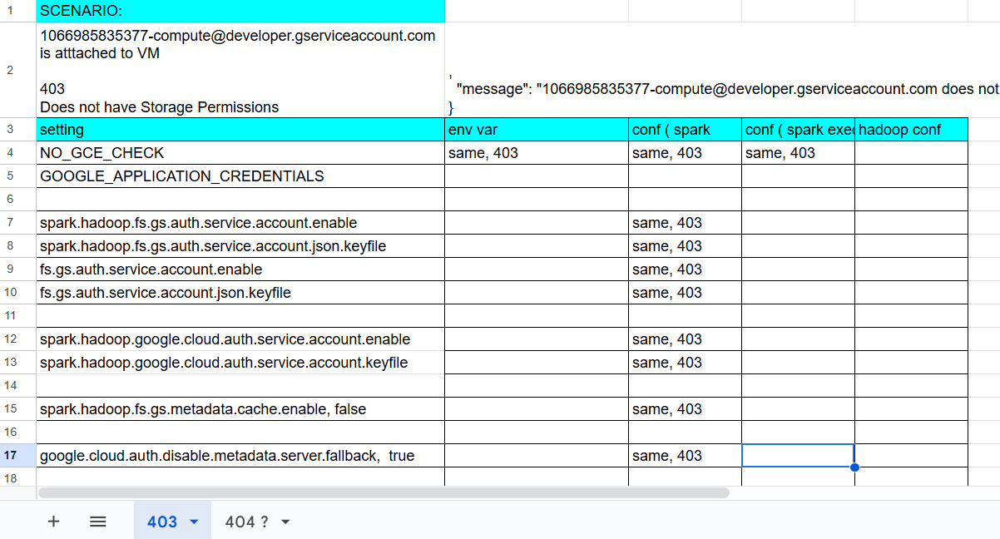
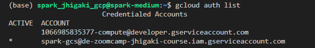
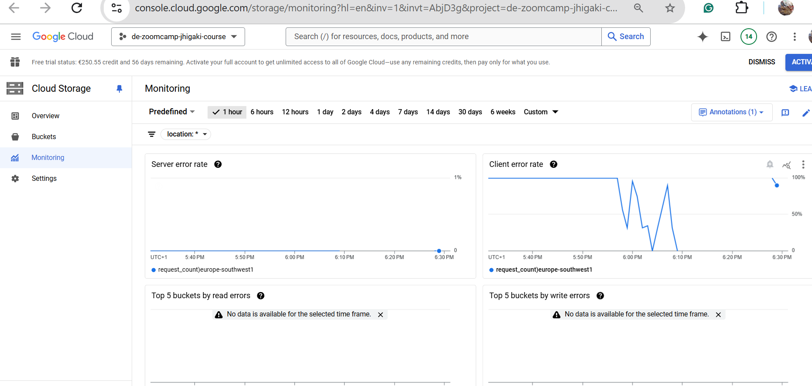
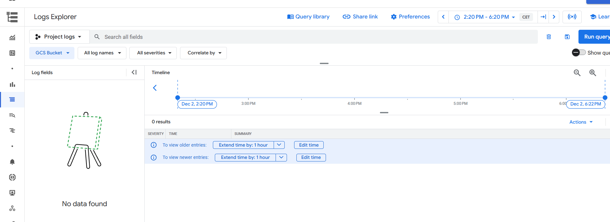
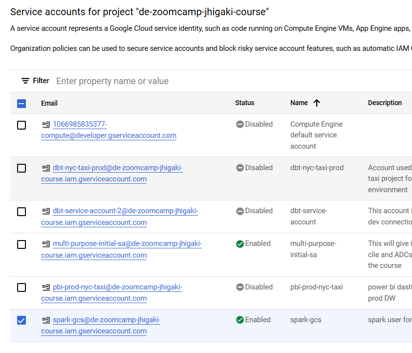
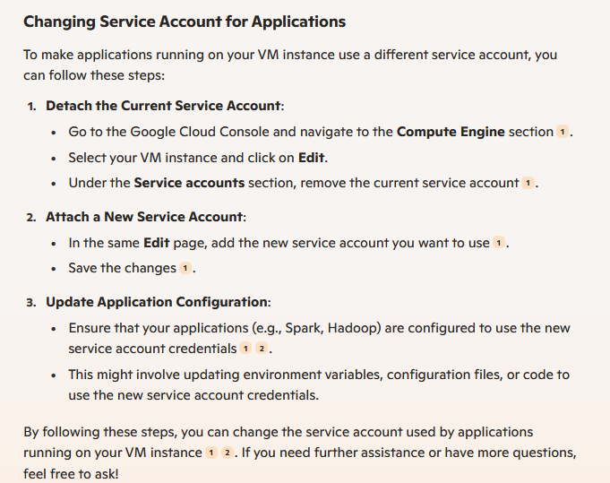

# How to specify Spark Credentials to GCS

**I don't know**
(so, I'm moving on as I've dedicated this troubleshoot full 4 working days :( )

When I got to the point where I needed to WRITE to parquet
I noticed that my supposedly service account `spark-gcs@de-zoomcamp-jhigaki-course.iam.gserviceaccount.com` was not being used.

THen I discovered that the service account the SPark executor always uses is `1066985835377-compute@developer.gserviceaccount.com` because is the one attached as the service account to run Google Cloud Services at the VM

I troubleshoooted by 
- Disabling the service account `1066985835377-compute@developer` - 401 
- Detaching the service account `1066985835377-compute@developer` from the VM - 404 not finding cred
- The service account `1066985835377-compute@developer` not having Storage Object read - 403 not enough perms


Was using this specific notebook to troubleshoot GPTs suggestions

[00_3_spark_credentials_test.ipynb](./00_3_spark_credentials_test.ipynb)
See [troubleshoot tactics](#spark--hadoop-confs)


Some promts to GPTs explain what I was going through

## Ask for help 1

Act as an expert hadoop, spark and google cloud data engineer

I have a python GCP VM: spark-medium.europe-southwest1-a.c.de-zoomcamp-jhigaki-course
That runs 
SPARK: spark-3.4.4-bin-hadoop3
JAVA: openjdk-11.0.2_linux-x64_bin.tar.gz
CONDA: Anaconda3-2024.10-1-Linux-x86_64.sh 
python=3.11
HADOOP Connector: gs://hadoop-lib/gcs/gcs-connector-3.0.4.jar

Jupyter Notebook runs on 8890
Spark works well in local and standalone mode when reading local files

when `spark-medium.europe-southwest1-a.c.de-zoomcamp-jhigaki-course` was created
a credential `1066985835377-compute@developer.gserviceaccount.com` was created as 'Compute Engine default service account'
for testing purposes  `1066985835377-compute@developer.gserviceaccount.com` only has  ROle: `BigQuery Data Viewer`

I created an additional service account `spark-gcs@de-zoomcamp-jhigaki-course.iam.gserviceaccount.com` that has ROle:`Storage Object User`

For testing purposes as well, service accounts at: https://console.cloud.google.com/iam-admin/serviceaccounts at, have the following status
`1066985835377-compute@developer.gserviceaccount.com` is disabled
`spark-gcs@de-zoomcamp-jhigaki-course.iam.gserviceaccount.com` is enabled

From the shell of `spark-medium.europe-southwest1-a.c.de-zoomcamp-jhigaki-course` 
Executing `gcloud auth list`
Response:
                       Credentialed Accounts
ACTIVE  ACCOUNT
        1066985835377-compute@developer.gserviceaccount.com
*       spark-gcs@de-zoomcamp-jhigaki-course.iam.gserviceaccount.com

VM `spark-medium.europe-southwest1-a.c.de-zoomcamp-jhigaki-course`  has a valid JSON key in its filesystem:
"/home/spark_jhigaki_gcp/de-zoomcamp-jhigaki-course----spark-gcs.json" which is the JSON key for `spark-gcs@de-zoomcamp-jhigaki-course.iam.gserviceaccount.com`

and it is referenced from environment variables at 
export GOOGLE_APPLICATION_CREDENTIALS="/home/spark_jhigaki_gcp/de-zoomcamp-jhigaki-course----spark-gcs.json"
and it is part of the .bashrc script
echo 'export GOOGLE_APPLICATION_CREDENTIALS="/home/spark_jhigaki_gcp/de-zoomcamp-jhigaki-course----spark-gcs.json"' >> ~/.bashrc

I run a jupyter notebook connected to jupyter server spark-medium.europe-southwest1-a.c.de-zoomcamp-jhigaki-course:8890

```python
import pyspark
from pyspark.sql import SparkSession
from pyspark.conf import SparkConf
from pyspark.context import SparkContext
credentials_location = '/home/spark_jhigaki_gcp/de-zoomcamp-jhigaki-course----spark-gcs.json'

conf = SparkConf() \
    .setMaster("local[*]") \
    .setAppName('test_7')\
    .set("spark.jars", "./spark/lib/gcs-connector-3.0.4.jar")\
    .set("spark.hadoop.google.cloud.auth.service.account.enable", "true") \
    .set("spark.hadoop.google.cloud.auth.service.account.json.keyfile", credentials_location)
sc = SparkContext(conf=conf)

hadoop_conf = sc._jsc.hadoopConfiguration()

hadoop_conf.set("fs.AbstractFileSystem.gs.impl",  "com.google.cloud.hadoop.fs.gcs.GoogleHadoopFS")
hadoop_conf.set("fs.gs.impl", "com.google.cloud.hadoop.fs.gcs.GoogleHadoopFileSystem")
hadoop_conf.set("fs.gs.auth.service.account.json.keyfile", credentials_location)
hadoop_conf.set("fs.gs.auth.service.account.enable", "true")

spark = SparkSession.builder \
    .config(conf=sc.getConf())\
    .getOrCreate()
	
df_green = spark.read\
    .parquet(f'gs://de-zoomcamp-jhigaki-nyc-taxi/pq/green/*/*')
```

when reading the parquet path I get an error

```bash
java.io.IOException: Error accessing gs://de-zoomcamp-jhigaki-nyc-taxi/pq/green/*/*
	at com.google.cloud.hadoop.repackaged.gcs.com.google.cloud.hadoop.gcsio.GoogleCloudStorageImpl.getObject(GoogleCloudStorageImpl.java:2181)
	at com.google.cloud.hadoop.repackaged.gcs.com.google.cloud.hadoop.gcsio.GoogleCloudStorageImpl.getItemInfo(GoogleCloudStorageImpl.java:2070)

Caused by: java.io.IOException: Unexpected Error code 401 trying to get security access token from Compute Engine metadata for the default service account: "Service account is deleted or disabled."
	at com.google.cloud.hadoop.repackaged.gcs.com.google.auth.oauth2.ComputeEngineCredentials.refreshAccessToken(ComputeEngineCredentials.java:280)
	at com.google.cloud.hadoop.repackaged.gcs.com.google.auth.oauth2.OAuth2Credentials$1.call(OAuth2Credentials.java:270)
	at com.google.cloud.hadoop.repackaged.gcs.com.google.auth.oauth2.OAuth2Credentials$1.call(OAuth2Credentials.java:267)
	at java.base/java.util.concurrent.FutureTask.run(FutureTask.java:264)
``` 

If I enable `1066985835377-compute@developer.gserviceaccount.com` I will get a 403, instead of a 401

```
Caused by: com.google.cloud.hadoop.repackaged.gcs.com.google.api.client.googleapis.json.GoogleJsonResponseException: 403 Forbidden
GET https://storage.googleapis.com/storage/v1/b/de-zoomcamp-jhigaki-nyc-taxi/o/pq%2Fgreen?fields=bucket,name,timeCreated,updated,generation,metageneration,size,contentType,contentEncoding,md5Hash,crc32c,metadata
{
  "code": 403,
  "errors": [
    {
      "domain": "global",
      "message": "1066985835377-compute@developer.gserviceaccount.com does not have storage.objects.get access to the Google Cloud Storage object. Permission 'storage.objects.get' denied on resource (or it may not exist).",
      "reason": "forbidden"
    }
  ],
  "message": "1066985835377-compute@developer.gserviceaccount.com does not have storage.objects.get access to the Google Cloud Storage object. Permission 'storage.objects.get' denied on resource (or it may not exist)."
}
```

I think that the hadoop - spark process is using `1066985835377-compute@developer.gserviceaccount.com` instead of  `spark-gcs@de-zoomcamp-jhigaki-course.iam.gserviceaccount.com` 
I run out of ideas on how to troubleshoot and check which credentials the spark/hadoop library is using.
As I think it is enough to set 
- "spark.hadoop.google.cloud.auth.service.account.json.keyfile"
- "fs.gs.auth.service.account.json.keyfile"
to where the JSON key file is:  '/home/spark_jhigaki_gcp/de-zoomcamp-jhigaki-course----spark-gcs.json'

1. What can be the steps to troubleshoot credentials used from the jupyter.spark.hadoop process? 
2. What can I do to tell jupyter.spark.hadoop process to use a specific credentials key. Considering that on the scenario described, I seem to stil be using the 1066985835377 ones

***** 


## Ask for help 2

I've detached the serviceAccount from the GCP VM per your last suggestion. 
But, I didn't attach a new one, as the objective is to have the service account / credentials being provided at the spark / hadoop configuration. 
In this particular case, the configuration is done through python code in a jupyter notebook just before creating the spark session. 
Also, I've set the env variable NO_GCE_CHECK=true.
This environment variable was set to the bash user session level, but it is the same bash process that was used to start the jupyter notebook that receives the instruction to start a Spark application
Still, the  internal spark.hadoop mechanism, doesn't use the credentials provided at 

```python
spark_conf.set("spark.hadoop.google.cloud.auth.service.account.json.keyfile"
spark_conf.set("spark.hadoop.fs.gs.auth.service.account.json.keyfile"
hadoop_conf.set("fs.gs.auth.service.account.json.keyfile"
``` 
And it tries to default to the Compute Engine Credentials 

Look at the stack trace. 
I think the JVM is using an internal mechanism to fetch File/resource access credentials where it is at a lower level than where the credentials I specified at the spark configuration session. Follow that suspicion, give me specific suggestions on how to troubleshoot and eventually specify a credentials file to use an specific service account. 


```bash
24/12/03 18:16:47 WARN MetricsConfig: Cannot locate configuration: tried hadoop-metrics2-google-hadoop-file-system.properties,hadoop-metrics2.properties
24/12/03 18:16:48 WARN FileStreamSink: Assume no metadata directory. Error while looking for metadata directory in the path: gs://de-zoomcamp-jhigaki-nyc-taxi/pq/green/*/*.
java.io.IOException: Error accessing gs://de-zoomcamp-jhigaki-nyc-taxi/pq/green/*/*
	at com.google.cloud.hadoop.repackaged.gcs.com.google.cloud.hadoop.gcsio.GoogleCloudStorageImpl.getObject(GoogleCloudStorageImpl.java:2181)
	at com.google.cloud.hadoop.repackaged.gcs.com.google.cloud.hadoop.gcsio.GoogleCloudStorageImpl.getItemInfo(GoogleCloudStorageImpl.java:2070)
	at com.google.cloud.hadoop.repackaged.gcs.com.google.cloud.hadoop.gcsio.GoogleCloudStorageFileSystemImpl.getFileInfoInternal(GoogleCloudStorageFileSystemImpl.java:1030)
	at com.google.cloud.hadoop.repackaged.gcs.com.google.cloud.hadoop.gcsio.GoogleCloudStorageFileSystemImpl.getFileInfoInternal(GoogleCloudStorageFileSystemImpl.java:1001)
	at com.google.cloud.hadoop.repackaged.gcs.com.google.cloud.hadoop.gcsio.GoogleCloudStorageFileSystemImpl.getFileInfo(GoogleCloudStorageFileSystemImpl.java:969)
	at com.google.cloud.hadoop.fs.gcs.GoogleHadoopFileSystem.lambda$getFileStatus$14(GoogleHadoopFileSystem.java:898)
	at org.apache.hadoop.fs.statistics.impl.IOStatisticsBinding.lambda$trackDurationOfOperation$5(IOStatisticsBinding.java:499)
	at org.apache.hadoop.fs.statistics.impl.IOStatisticsBinding.trackDuration(IOStatisticsBinding.java:444)
	at com.google.cloud.hadoop.fs.gcs.GhfsGlobalStorageStatistics.trackDuration(GhfsGlobalStorageStatistics.java:114)
	at com.google.cloud.hadoop.fs.gcs.GoogleHadoopFileSystem.trackDurationWithTracing(GoogleHadoopFileSystem.java:759)
	at com.google.cloud.hadoop.fs.gcs.GoogleHadoopFileSystem.getFileStatus(GoogleHadoopFileSystem.java:886)
	at org.apache.hadoop.fs.FileSystem.isDirectory(FileSystem.java:1777)
	at org.apache.spark.sql.execution.streaming.FileStreamSink$.hasMetadata(FileStreamSink.scala:54)
	at org.apache.spark.sql.execution.datasources.DataSource.resolveRelation(DataSource.scala:366)
	at org.apache.spark.sql.DataFrameReader.loadV1Source(DataFrameReader.scala:229)
	at org.apache.spark.sql.DataFrameReader.$anonfun$load$2(DataFrameReader.scala:211)
	at scala.Option.getOrElse(Option.scala:189)
	at org.apache.spark.sql.DataFrameReader.load(DataFrameReader.scala:211)
	at org.apache.spark.sql.DataFrameReader.parquet(DataFrameReader.scala:563)
	at java.base/jdk.internal.reflect.NativeMethodAccessorImpl.invoke0(Native Method)
	at java.base/jdk.internal.reflect.NativeMethodAccessorImpl.invoke(NativeMethodAccessorImpl.java:62)
	at java.base/jdk.internal.reflect.DelegatingMethodAccessorImpl.invoke(DelegatingMethodAccessorImpl.java:43)
	at java.base/java.lang.reflect.Method.invoke(Method.java:566)
	at py4j.reflection.MethodInvoker.invoke(MethodInvoker.java:244)
	at py4j.reflection.ReflectionEngine.invoke(ReflectionEngine.java:374)
	at py4j.Gateway.invoke(Gateway.java:282)
	at py4j.commands.AbstractCommand.invokeMethod(AbstractCommand.java:132)
	at py4j.commands.CallCommand.execute(CallCommand.java:79)
	at py4j.ClientServerConnection.waitForCommands(ClientServerConnection.java:182)
	at py4j.ClientServerConnection.run(ClientServerConnection.java:106)
	at java.base/java.lang.Thread.run(Thread.java:834)
Caused by: java.io.IOException: Error code 404 trying to get security access token from Compute Engine metadata for the default service account. This may be because the virtual machine instance does not have permission scopes specified. It is possible to skip checking for Compute Engine metadata by specifying the environment  variable NO_GCE_CHECK=true.
	at com.google.cloud.hadoop.repackaged.gcs.com.google.auth.oauth2.ComputeEngineCredentials.refreshAccessToken(ComputeEngineCredentials.java:268)
	at com.google.cloud.hadoop.repackaged.gcs.com.google.auth.oauth2.OAuth2Credentials$1.call(OAuth2Credentials.java:270)
	at com.google.cloud.hadoop.repackaged.gcs.com.google.auth.oauth2.OAuth2Credentials$1.call(OAuth2Credentials.java:267)
	at java.base/java.util.concurrent.FutureTask.run(FutureTask.java:264)
	at com.google.cloud.hadoop.repackaged.gcs.com.google.auth.oauth2.OAuth2Credentials$RefreshTask.run(OAuth2Credentials.java:635)
	at com.google.cloud.hadoop.repackaged.gcs.com.google.common.util.concurrent.DirectExecutor.execute(DirectExecutor.java:31)
	at com.google.cloud.hadoop.repackaged.gcs.com.google.auth.oauth2.OAuth2Credentials$AsyncRefreshResult.executeIfNew(OAuth2Credentials.java:582)
	at com.google.cloud.hadoop.repackaged.gcs.com.google.auth.oauth2.OAuth2Credentials.asyncFetch(OAuth2Credentials.java:233)
	at com.google.cloud.hadoop.repackaged.gcs.com.google.auth.oauth2.OAuth2Credentials.getRequestMetadata(OAuth2Credentials.java:183)
	at com.google.cloud.hadoop.repackaged.gcs.com.google.auth.http.HttpCredentialsAdapter.initialize(HttpCredentialsAdapter.java:96)
	at com.google.cloud.hadoop.repackaged.gcs.com.google.cloud.hadoop.util.RetryHttpInitializer.initialize(RetryHttpInitializer.java:80)
	at com.google.cloud.hadoop.repackaged.gcs.com.google.cloud.hadoop.util.ChainingHttpRequestInitializer.initialize(ChainingHttpRequestInitializer.java:52)
	at com.google.cloud.hadoop.repackaged.gcs.com.google.api.client.http.HttpRequestFactory.buildRequest(HttpRequestFactory.java:91)
	at com.google.cloud.hadoop.repackaged.gcs.com.google.api.client.googleapis.services.AbstractGoogleClientRequest.buildHttpRequest(AbstractGoogleClientRequest.java:415)
	at com.google.cloud.hadoop.repackaged.gcs.com.google.api.client.googleapis.services.AbstractGoogleClientRequest.executeUnparsed(AbstractGoogleClientRequest.java:525)
	at com.google.cloud.hadoop.repackaged.gcs.com.google.api.client.googleapis.services.AbstractGoogleClientRequest.executeUnparsed(AbstractGoogleClientRequest.java:466)
	at com.google.cloud.hadoop.repackaged.gcs.com.google.api.client.googleapis.services.AbstractGoogleClientRequest.execute(AbstractGoogleClientRequest.java:576)
	at com.google.cloud.hadoop.repackaged.gcs.com.google.cloud.hadoop.gcsio.GoogleCloudStorageImpl.getObject(GoogleCloudStorageImpl.java:2174)
``` 

**** 


## Some troubleshoots I did

### SPark / Hadoop Confs 

* NO_GCE_CHECK
* spark.executorEnv.NO_GCE_CHECK
* GOOGLE_APPLICATION_CREDENTIALS
* spark.hadoop.fs.gs.auth.service.account.enable
* spark.hadoop.fs.gs.auth.service.account.json.keyfile
* fs.gs.auth.service.account.enable
* fs.gs.auth.service.account.json.keyfile
* spark.hadoop.google.cloud.auth.service.account.enable
* spark.hadoop.google.cloud.auth.service.account.keyfile
* spark.hadoop.fs.gs.metadata.cache.enable, false
* google.cloud.auth.disable.metadata.server.fallback,  true
* spark.hadoop.NO_GCE_CHECK

I was going crazy:

[](https://docs.google.com/spreadsheets/d/1PXHTLidrzxbjpJMVCymm8M1XO9eJkKx7c4TEiVEOpfs/edit?usp=sharing)


## Older Troubleshoots 
### Test to revoke 
`cloud auth application-default revoke`

```
Application Default Credentials have not been set up, nothing to revoke.
```

### restart sparks GOOGLE_APPLICATION_CREDENTIALS

I stopped jupyter and master / worker sparks
Made sure that env variable is set to: 
 
`export GOOGLE_APPLICATION_CREDENTIALS="/home/spark_jhigaki_gcp/de-zoomcamp-jhigaki-course----spark-gcs.json"`

restarted jupyter, master // worker spark

### CHanging account on gcloud of the CLI

Doesn't seem to have an effect on what spark hadoop uses to authenticate

Also, 

 gcloud config set account `spark-gcs@de-zoomcamp-jhigaki-course.iam.gserviceaccount.com`



But I still gget the error


GET https://storage.googleapis.com/storage/v1/b/de-zoomcamp-jhigaki-nyc-taxi/o/pq%2Fgreen%2F*%2F*?fields=bucket,name,timeCreated,updated,generation,metageneration,size,contentType,contentEncoding,md5Hash,crc32c,metadata
{
  "code": 403,
  "errors": [
	{
	  "domain": "global",
	  "message": "1066985835377-compute@developer.gserviceaccount.com does not have storage.objects.get access to the Google Cloud Storage object. Permission 'storage.objects.get' denied on resource (or it may not exist).",
	  "reason": "forbidden"
	}
  ],
  "message": "1066985835377-compute@developer.gserviceaccount.com does not have storage.objects.get access to the Google Cloud Storage object. Permission 'storage.objects.get' denied on resource (or it may not exist)."
}


### Tried monitor API calls without success

activate-service-account


****************************************
I restarted the VM
Gave `1066985835377` Storage Object Viewer
Worked again

It seems that when I disable a eservice account. or change permissions
It takes some minutes to reflect it


SO if I do an immediate .read / .show. It may keep working, and I don't know which credentials is using


 I cannot seem to find the way to monitor API calls for starage queries
 


 


Spark GCS credentials are not being used
 

### Renamed the keys file

I did notice that YOU DON'T NEED THE KEYS.JSON file if you have the service account attached to the VM (uses internal token exchange from Google Metadata Compute Engine... something like that)

`echo 'export GOOGLE_APPLICATION_CREDENTIALS="/home/spark_jhigaki_gcp/de-zoomcamp-jhigaki-course----spark-gcs.json"' >> ~/.bashrc`

`mv /home/spark_jhigaki_gcp/de-zoomcamp-jhigaki-course----spark-gcs.json /home/spark_jhigaki_gcp/de-zoomcamp-jhigaki-course----spark-gcs.json_different`



