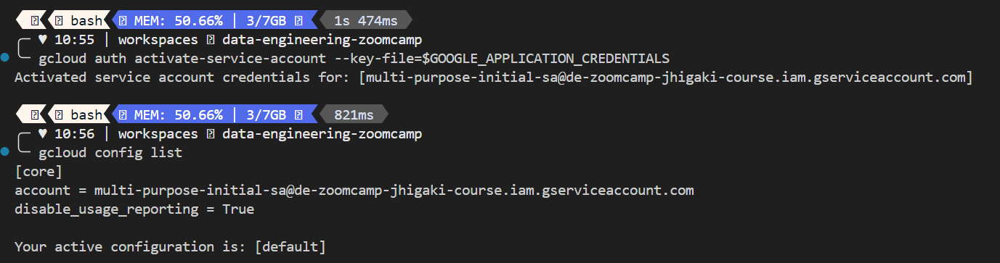
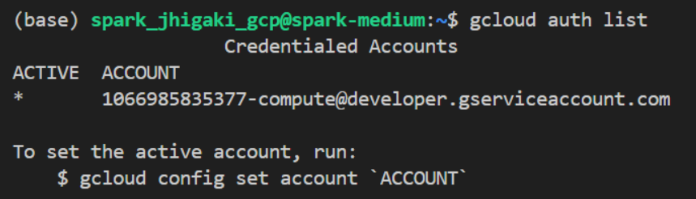
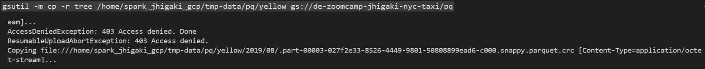
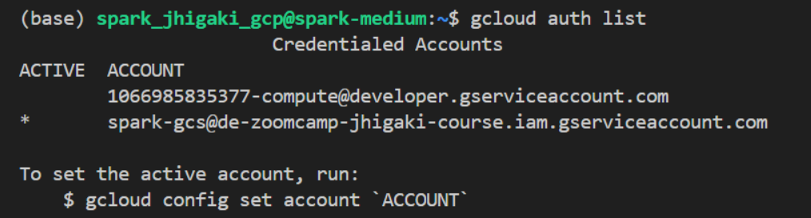
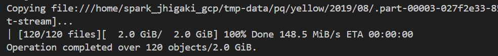
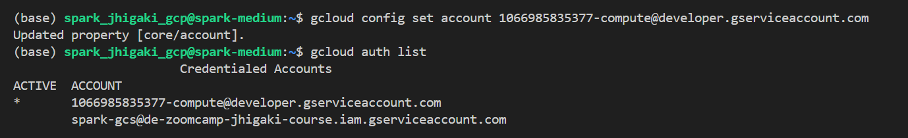

# Dev Container: Specify creds file from 

In the vs.code dev container console

`export GOOGLE_APPLICATION_CREDENTIALS="/workspaces/data-engineering-zoomcamp/.gcp.auth/de-zoomcamp-jhigaki-course-68ab014c1efe.json"`

`gcloud auth activate-service-account --key-file=$GOOGLE_APPLICATION_CREDENTIALS`



Make Sure credentials are enabled

Make sure Role: `Compute Admin`

# Dev Container: Start Stop VM

```bash
gcloud compute instances start spark-medium \
    --project=de-zoomcamp-jhigaki-course \
    --zone=europe-southwest1-a
```
```bash
gcloud compute instances stop spark-medium \
    --project=de-zoomcamp-jhigaki-course \
    --zone=europe-southwest1-a
```

# GCP VM: Copy files from VM local to GCS bucket

In the vs.code dev c ontainer console

By now, we have pq written files to local filesystem tree `tmp-data/pq/yellow` / `green`

```bash
!tree tmp-data/pq/yellow

tmp-data/pq/yellow
└── 2019
    ├── 01
    │   ├── _SUCCESS
    │   ├── part-00000-78e7fa25-1b5c-4614-92b5-7582ed9e87a5-c000.snappy.parquet
    │   ├── part-00001-78e7fa25-1b5c-4614-92b5-7582ed9e87a5-c000.snappy.parquet
    │   ├── part-00002-78e7fa25-1b5c-4614-92b5-7582ed9e87a5-c000.snappy.parquet
    │   └── part-00003-78e7fa25-1b5c-4614-92b5-7582ed9e87a5-c000.snappy.parquet
    ├── 02
    │   ├── _SUCCESS
    │   ├── part-00000-c3529dcc-d5e7-4564-af4e-153fd17d9b98-c000.snappy.parquet
    │   ├── part-00001-c3529dcc-d5e7-4564-af4e-153fd17d9b98-c000.snappy.parquet
    │   ├── part-00002-c3529dcc-d5e7-4564-af4e-153fd17d9b98-c000.snappy.parquet
    │   └── part-00003-c3529dcc-d5e7-4564-af4e-153fd17d9b98-c000.snappy.parquet
    ├── 03
    │   ├── _SUCCESS
    │   ├── part-00000-4df845c0-abe4-47d4-9482-91ce6c95a005-c000.snappy.parquet
    │   ├── part-00001-4df845c0-abe4-47d4-9482-91ce6c95a005-c000.snappy.parquet
    │   ├── part-00002-4df845c0-abe4-47d4-9482-91ce6c95a005-c000.snappy.parquet
    │   └── part-00003-4df845c0-abe4-47d4-9482-91ce6c95a005-c000.snappy.parquet
    ├── 04
    │   ├── _SUCCESS
    │   ├── part-00000-80362699-5b05-430e-a848-e2d857d44324-c000.snappy.parquet
    │   ├── part-00001-80362699-5b05-430e-a848-e2d857d44324-c000.snappy.parquet
    │   ├── part-00002-80362699-5b05-430e-a848-e2d857d44324-c000.snappy.parquet
...
        ├── part-00002-9c10ef22-f812-4c5c-b812-b3989fd5d9ba-c000.snappy.parquet
        └── part-00003-9c10ef22-f812-4c5c-b812-b3989fd5d9ba-c000.snappy.parquet

14 directories, 60 files
```

By default, in the running VM we already have gcloud CLI installed



## GCP VM: Copy files into GS

We can copy the files from `spark-medium` into gs, bucket `de-zoomcamp-jhigaki-nyc-taxi` 

Let's try first if we can add objects to GCS through the default service account `1066985835377-compute@developer.gserviceaccount.com` 

`gsutil -m cp -r tree /home/spark_jhigaki_gcp/tmp-data/pq/yellow gs://de-zoomcamp-jhigaki-nyc-taxi/pq`



Access denied. 
This is because the `1066985835377-compute@developer.gserviceaccount.com`  doesn't have access to write in buckets

## Local Host: Add credential and generate service key

Let's generate a credential in the cloud conmsole web UI...

name: `spark-gcs@de-zoomcamp-jhigaki-course.iam.gserviceaccount.com`

This credential has Role: `Storage Object User`

Generated a JSON key, doenloaded it to  the vs.code web container

`.gcp.auth/de-zoomcamp-jhigaki-course----spark-gcs.json`

Let's copy it to the VM

```bash
scp \
    /workspaces/data-engineering-zoomcamp/.gcp.auth/de-zoomcamp-jhigaki-course----spark-gcs.json \
    spark_jhigaki_gcp@de-zoomcamp-spark-medium:de-zoomcamp-jhigaki-course----spark-gcs.json

```

## GCP VM: Add and Activate service account

`gcloud auth activate-service-account --key-file=/home/spark_jhigaki_gcp/de-zoomcamp-jhigaki-course----spark-gcs.json`




## GCP VM: Try copy again

`gsutil -m cp -r /home/spark_jhigaki_gcp/tmp-data/pq/yellow gs://de-zoomcamp-jhigaki-nyc-taxi/pq`

SUCCESS


## Setting up Hadoop Connector for GCS

As we are not using DataProc (Managed SPark service from Google). Follow instructions from:
https://cloud.google.com/dataproc/docs/concepts/connectors/cloud-storage#connector-setup-on-non-dataproc-clusters

LAtest (non prod)
https://storage.googleapis.com/hadoop-lib/gcs/gcs-connector-hadoop3-latest.jar 

After doing `gsutil ls gs://hadoop-lib/gcs | grep 3.0.4`

Download  Versioned (more control)
`mkdir ~/spark/lib`
`gsutil cp gs://hadoop-lib/gcs/gcs-connector-3.0.4.jar ~/spark/lib/.`

Using temporarily service account from VM

`gcloud config set account 1066985835377-compute@developer.gserviceaccount.com`




This is so that I can make sure that spark process uses the other the `spark-gcs` credentials / key
`de-zoomcamp-jhigaki-course----spark-gcs.json`


`gcloud config set account spark-gcs@de-zoomcamp-jhigaki-course.iam.gserviceaccount.com`


`gsutil -m cp -r /home/spark_jhigaki_gcp/tmp-data/pq/green gs://de-zoomcamp-jhigaki-nyc-taxi/pq`

