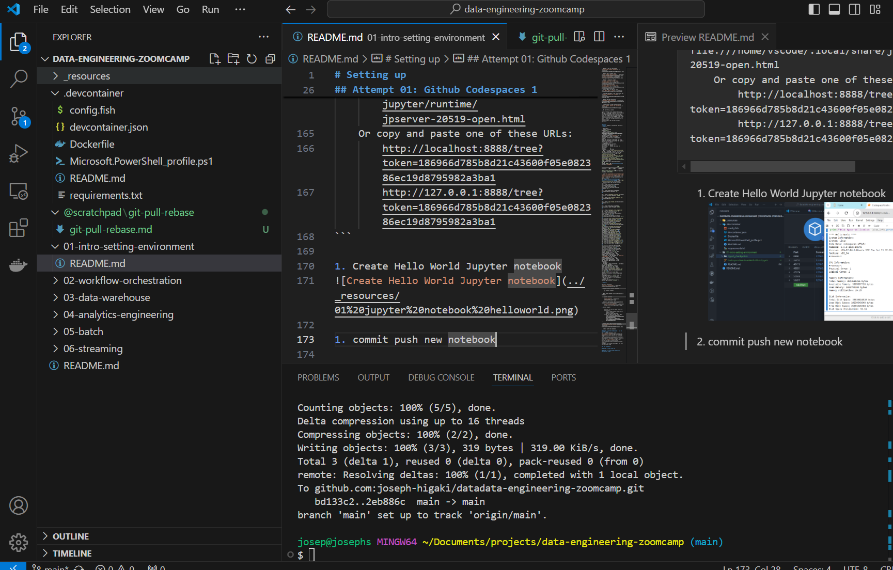
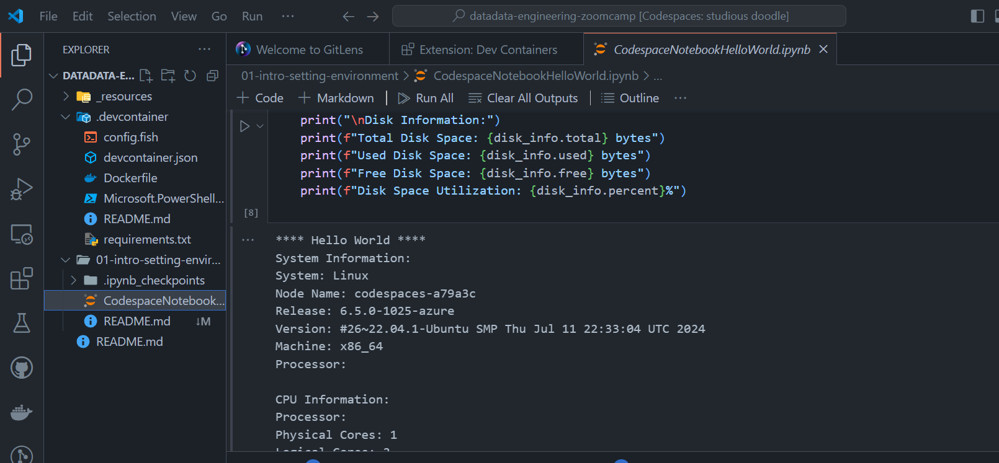
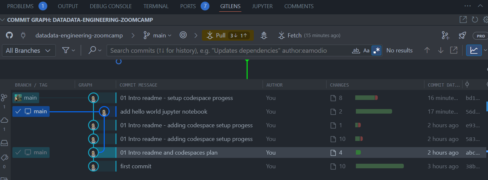
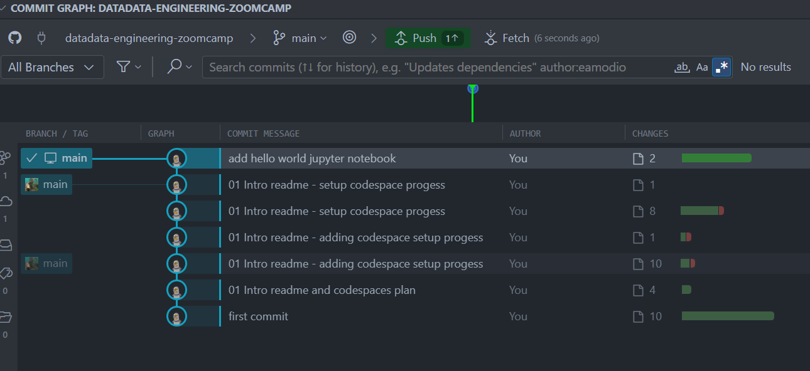

# Refresher of rebases on Git
I kept working on VS Code adding the readmes


While i had another VS Code, same repo, adding a jupyter notebook in the configured codespace


So, it turned out that jupyter notebook added commit, was based on an old main branch version


So. Refresher of git rebase thansk to MS Copilot

Sure, I can help you with that! The error you're seeing indicates that there are divergent branches, meaning your local branch and the remote branch have different commits. To update your local branch with the latest changes from the remote branch without losing your local changes, you can use the 
```
git pull --rebase
git pull --rebase origin main

``` 
command. Here’s a step-by-step explanation:

1. **Fetch the latest changes from the remote repository**:
   ```bash
   git fetch origin
   ```
   This command downloads the latest changes from the remote repository but does not merge them into your local branch yet.

2. **Rebase your local changes on top of the fetched changes**:
   ```bash
   git rebase origin/main
   ```
   This command re-applies your local commits on top of the commits from the remote branch. It effectively moves your local changes to the latest state of the remote branch.

3. **Resolve any conflicts**:
   If there are any conflicts during the rebase, Git will pause and prompt you to resolve them. You can open the conflicting files, make the necessary changes, and then mark them as resolved:
   ```bash
   git add <file>
   ```
   After resolving all conflicts, continue the rebase process:
   ```bash
   git rebase --continue
   ```

4. **Abort the rebase if necessary**:
   If you encounter too many conflicts or decide not to proceed with the rebase, you can abort it and return to the state before the rebase:
   ```bash
   git rebase --abort
   ```

5. **Push your changes to the remote repository**:
   Once the rebase is complete and there are no conflicts, you can push your updated local branch to the remote repository:
   ```bash
   git push origin main
   ```

By following these steps, you ensure that your local changes are preserved and applied on top of the latest changes from the remote branch.

1. Now jupyter notebook changes are on top of 
